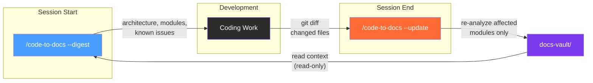

# code-to-docs

A Claude Code skill that analyzes codebases and generates Obsidian-native documentation vaults with architecture diagrams, API references, codebase health assessments, and teaching-focused explanations at three audience levels. Supports a full development lifecycle: digest existing docs at session start, code, then update docs at session end.

## What It Does

Point it at a codebase and it produces a complete Obsidian vault:

- **Architecture docs** with Mermaid diagrams and a spatial Canvas map
- **Module documentation** at three audience levels (beginner, intermediate, advanced)
- **API reference** with function signatures, parameters, and return types
- **Codebase health assessment** — limitations, bugs/risks, improvement opportunities with Mermaid severity charts
- **Educational code review** — before/after code snippets showing what's wrong and how to fix it
- **Index pages** with Dataview queries for navigation
- **State tracking** — modules, dependencies, issues, and session history for incremental updates

Beyond generation, the skill supports the full development lifecycle:

- **Digest** (`--digest`) — load existing vault context into a conversation before coding (read-only, token-budgeted)
- **Update** (`--update`) — after coding, re-analyze only changed modules via `git diff`, merge with existing docs, track issue resolution

### Modes

| Mode | What It Does |
|------|-------------|
| **quick** (default) | Architecture overview, module docs, API reference, health assessment, index — all at three audience levels |
| **full** | Everything in quick + design patterns, onboarding guides, cross-cutting concerns, tutorials |
| **--update** | Incremental update — diffs against last run, re-analyzes affected modules, auto-selects quick/full |
| **--digest** | Loads existing vault context into the conversation (read-only, no file writes) |

### Three Audience Levels

Every module doc includes all three as sections:

- **Beginner** — explains language constructs, annotated walkthroughs, no jargon
- **Intermediate** — design rationale, patterns, module interactions, trade-offs
- **Advanced** — concurrency, performance, failure modes, edge cases, code review notes

### Three Model Tiers

The skill uses Haiku, Sonnet, and Opus strategically to minimize token cost without sacrificing quality:

| Tier | Model | Use |
|------|-------|-----|
| **Extract** | Haiku | Code extraction, mechanical generation (Canvas, Index, state file), verification, digest |
| **Write** | Sonnet | Narrative writing, pedagogical content, health report assembly |
| **Reason** | Opus | Deep issue analysis (complex modules), cross-module synthesis (5+ modules) |

Opus is used conditionally — only for modules rated High complexity, exceeding 1000 LOC, or involving concurrency/security, and for synthesis on codebases with 5+ modules or complex dependency graphs. Digest mode uses Haiku exclusively.

## Installation

### Via Claude Code Plugin Marketplace (recommended)

Add this repo as a marketplace source, then install the plugin:

```
/plugin marketplace add RCellar/code-to-docs-skill
/plugin install code-to-docs@code-to-docs-skill
```

### Manual Installation

Copy the skill files directly:

```bash
mkdir -p ~/.claude/skills/code-to-docs
cp skills/code-to-docs/* ~/.claude/skills/code-to-docs/
```

## Usage

### Generate Documentation

```
/code-to-docs /path/to/codebase
/code-to-docs /path/to/codebase --mode full
/code-to-docs /path/to/codebase --mode quick --output ./my-docs/
```

### Incremental Update (after coding)

```
/code-to-docs /path/to/codebase --update
```

Reads `_state/analysis.json` from the existing vault, runs `git diff` against the stored commit, and re-analyzes only affected modules. Auto-selects quick or full based on scope of changes:
- **Quick** — changes within existing modules only
- **Full** — new modules detected, modules removed, dependency structure changed, or >50% of files changed

Tracks issues across runs: resolved issues marked, new issues added, unchanged module issues carried forward.

### Digest Context (before coding)

```
/code-to-docs --digest ./docs-vault
/code-to-docs --digest ./docs-vault --scope Auth,Database --focus issues
/code-to-docs --digest ./docs-vault --focus all
```

Loads existing vault context into the conversation — architecture, module summaries, known issues, session history — without modifying any files. Token-budgeted: <3K default, <6K with scoped modules, <10K with `--focus all`.

### Development Lifecycle

The three modes form an optional workflow:



```
Session start:  /code-to-docs --digest ./docs-vault --scope {modules you'll touch}
Coding work:    ... normal development ...
Session end:    /code-to-docs /path/to/codebase --update
```

Each mode works independently — you don't need the full lifecycle to use any single one.

### Automating with Hooks (optional)

Install project-level hooks to automate the lifecycle:

```
/code-to-docs --hooks setup [vault-path]
/code-to-docs --hooks teardown
```

| Hook | Fires On | Does |
|------|----------|------|
| `digest-on-start.sh` | Session start | Injects vault summary into context (modules, issues, staleness) |
| `update-hint-on-commit.sh` | `git commit` | Reminds Claude to suggest `--update` when session ends |

Hooks are project-local (`.claude/settings.json`), lightweight (read-only shell scripts), and removable with teardown. Set `CODE_TO_DOCS_VAULT` env var to override vault path.

### Arguments

| Argument | Required | Default | Description |
|----------|----------|---------|-------------|
| `<path>` | Yes (generate/update) | — | Root of the codebase to document |
| `--mode` | No | `quick` | `quick` or `full` (ignored with `--update`/`--digest`) |
| `--update` | No | — | Incremental update from existing vault state |
| `--digest` | No | — | Load existing vault context (read-only) |
| `--scope` | No (digest only) | all (overview) | Comma-separated module names to load in full |
| `--focus` | No (digest only) | `architecture` | `architecture`, `issues`, or `all` |
| `--output` | No | `./docs-vault/` | Output path (relative to codebase root) |

## Output Structure

```
docs-vault/
├── _state/
│   └── analysis.json           # State: modules, deps, issues, session history
├── Architecture/
│   ├── System Overview.md      # Mermaid diagrams + narrative
│   ├── Dependency Map.md       # Cross-module dependencies
│   └── System Map.canvas       # Spatial map linking modules
├── Modules/
│   └── {Module Name}.md        # Beginner + Intermediate + Advanced + API + Review Notes
├── Health/
│   ├── Limitations.md          # Architecture and component constraints
│   ├── Code Review.md          # Bugs, risks, improvements with before/after code
│   └── Health Summary.md       # Severity charts (Mermaid pie/bar)
├── Patterns/                   # full mode only
├── Onboarding/                 # full mode only
├── Cross-Cutting/              # full mode only
├── Documentation.base          # Obsidian Bases catalog (native, no plugins)
└── Index.md                    # Dataview queries (fallback for non-Bases users)
```

The `_state/analysis.json` file tracks:
- Module list and dependency graph
- Files analyzed with hashes (for change detection)
- Git commit hash and timestamp (for `--update` diffs)
- Issues array with open/resolved status (for health tracking across runs)
- Sessions array logging every generate/update/digest event

## How It Works

### Generate (quick/full)

**Phase 1 — Analysis (two-pass):**
1. Surveys the codebase — entry points, config files, directory structure
2. Identifies independent modules
3. **Pass 1** — dispatches parallel **Haiku** agents to extract structure (architecture, API, patterns, dependencies, complexity, key files)
4. **Pass 2** — dispatches **Sonnet/Opus** agents to identify limitations and improvements, receiving the Haiku output as input (no re-reading code)
5. Synthesizes into dependency graph, architecture narrative, and aggregated issues

**Phase 2 — Generation (parallel):**
- **Sonnet** agents: module docs (one per module), System Overview, health reports, full-mode extras
- **Haiku** agents: Canvas, Dependency Map, Index, state file, Health Summary charts

**Phase 3 — Verification:**
- **Haiku** agent checks all wikilinks resolve and all files have complete frontmatter

### Update (`--update`)

1. Reads `_state/analysis.json` from existing vault
2. Runs `git diff <stored_commit>..HEAD` to identify changed files
3. Maps changed files to affected modules
4. Auto-selects quick or full based on change scope
5. Re-analyzes only affected modules (two-pass, same as generate)
6. Merges new results with existing vault — unchanged module docs preserved
7. Updates state file with new commit, merged issues, session entry
8. Runs full verification across the entire vault

### Digest (`--digest`)

1. Validates vault exists with `_state/analysis.json`
2. Loads architecture overview and module map (always)
3. Loads additional content based on `--focus` (issues, architecture, or all)
4. Loads full docs for `--scope` modules, overview-only for the rest
5. Presents structured context summary to the conversation

## Skill Files

| File | Purpose |
|------|---------|
| `SKILL.md` | Entry point — all modes (generate/update/digest), model tier rules, lifecycle, red flags |
| `analysis-guide.md` | Phase 1 reference — two-pass agent templates, model selection, synthesis, incremental update flow |
| `obsidian-templates.md` | Phase 2 reference — frontmatter schema, audience levels, health templates, callouts, Mermaid |
| `output-structure.md` | Phase 2 reference — vault layout, generation model assignments, Canvas rules, state file schema |
| `hooks/setup.sh` | Installs project-level SessionStart and PostToolUse hooks |
| `hooks/teardown.sh` | Removes code-to-docs hooks from project settings |
| `hooks/digest-on-start.sh` | SessionStart hook — injects vault summary into conversation context |
| `hooks/update-hint-on-commit.sh` | PostToolUse hook — reminds to update docs after git commits |

## Examples

The `examples/` directory contains complete output vaults you can open directly in Obsidian:

- **dockhand/** — full-mode vault from a SvelteKit + Go container management UI (10 modules, 4 patterns, onboarding guides, 3 cross-cutting concerns, health assessment with limitations and code review)

## Pressure Tests

Three test scenarios in `tests/`:

- `pressure-test-quick-mode.md` — validates quick mode on a 3-5 module codebase
- `pressure-test-full-mode.md` — validates full mode additions
- `pressure-test-parallel.md` — validates parallel dispatch discipline on 5+ modules

## Obsidian Integration

### Obsidian Bases (native, no plugins)

Every vault includes a `Documentation.base` file — an interactive catalog of all generated docs with columns for type, complexity, language, and status. Users can filter, sort, switch between table/card views, and add computed columns directly in Obsidian. No Dataview plugin required.

Index.md with Dataview queries is still generated as a fallback for users who prefer it or don't have Bases enabled.

### Obsidian CLI (opportunistic)

If the `obsidian` CLI is available and Obsidian is running, the skill uses it for note creation (`obsidian create`) and property management (`obsidian property:set`). This provides:

- Native wikilink resolution (Obsidian handles renames automatically)
- Property validation through Obsidian's storage system
- Backlink verification via Obsidian's live graph

If the CLI is not available, the skill falls back to direct file writes with no degradation. This is an enhancement, not a requirement.

### Related Skills

The skill integrates with other Obsidian plugin skills when available:

| Skill | Used For |
|-------|---------|
| `obsidian-markdown` | Authoritative syntax for wikilinks, callouts, embeds, frontmatter |
| `json-canvas` | Canvas file spec reference for System Map generation |
| `obsidian-bases` | Bases file spec reference for Documentation.base generation |

## Future Enhancements

- Configurable output format (portable markdown vs Obsidian-native)
- Excalidraw diagram generation

## License

MIT
