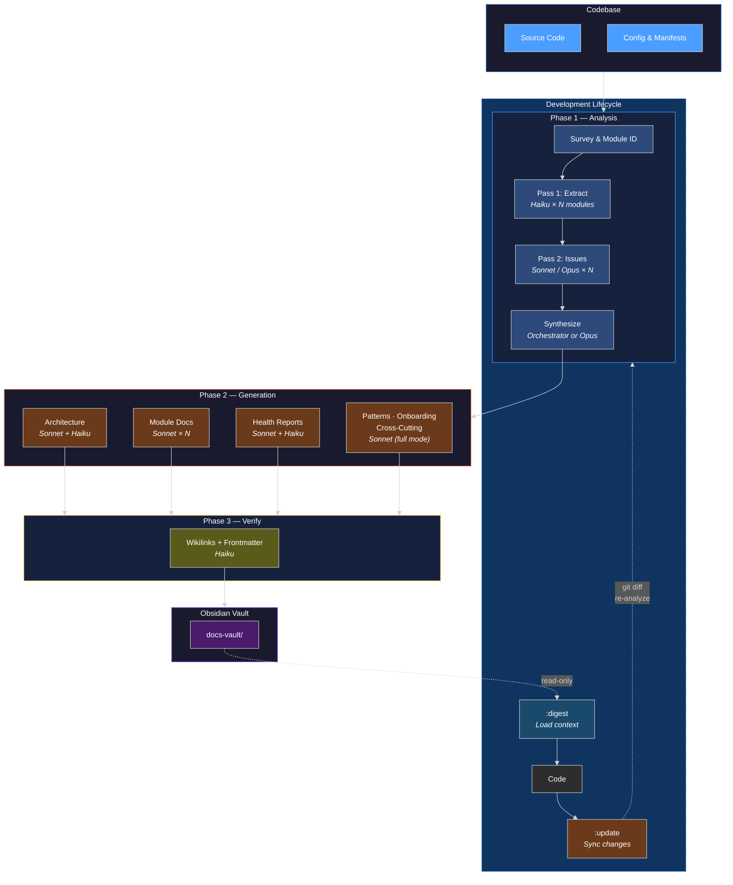

# code-to-docs

A Claude Code skill that analyzes codebases and generates Obsidian-native documentation vaults with architecture diagrams, API references, codebase health assessments, and teaching-focused explanations at three audience levels. Supports a full development lifecycle: digest existing docs at session start, code, then update docs at session end.



<p align="center">
  
</p>

## What It Does

Point it at a codebase and it produces a complete Obsidian vault:

- **Architecture docs** with Mermaid diagrams and a spatial Canvas map
- **Module documentation** at three audience levels (beginner, intermediate, advanced)
- **API reference** with function signatures, parameters, and return types
- **Codebase health assessment** — limitations, bugs/risks, improvement opportunities with Mermaid severity charts
- **Educational code review** — before/after code snippets showing what's wrong and how to fix it
- **Index pages** with Dataview queries for navigation
- **State tracking** — modules, dependencies, issues, and session history for incremental updates

Beyond generation, the skill supports the full development lifecycle:

- **Digest** (`:digest`) — load existing vault context into a conversation before coding (read-only, token-budgeted)
- **Update** (`:update`) — after coding, re-analyze only changed modules via `git diff`, merge with existing docs, track issue resolution

### Modes

| Mode | What It Does |
|------|-------------|
| **quick** (default) | Architecture overview, module docs, API reference, health assessment, index — all at three audience levels |
| **full** | Everything in quick + design patterns, onboarding guides, cross-cutting concerns, tutorials |
| **:update** | Incremental update — diffs against last run, re-analyzes affected modules, auto-selects quick/full |
| **:digest** | Loads existing vault context into the conversation (read-only, no file writes) |

### Three Audience Levels

Every module doc includes all three as sections:

- **Beginner** — explains language constructs, annotated walkthroughs, no jargon
- **Intermediate** — design rationale, patterns, module interactions, trade-offs
- **Advanced** — concurrency, performance, failure modes, edge cases, code review notes

### Three Model Tiers

The skill uses Haiku, Sonnet, and Opus strategically to minimize token cost without sacrificing quality:

| Tier | Model | Use |
|------|-------|-----|
| **Extract** | Haiku | Code extraction, mechanical generation (Canvas, Index, state file), verification, digest |
| **Write** | Sonnet | Narrative writing, pedagogical content, health report assembly |
| **Reason** | Opus | Deep issue analysis (complex modules), cross-module synthesis (5+ modules) |

Opus is used conditionally — only for modules rated High complexity, exceeding 1000 LOC, or involving concurrency/security, and for synthesis on codebases with 5+ modules or complex dependency graphs. Digest mode uses Haiku exclusively.

Each phase has a **dispatch table** — an authoritative checklist listing every agent call with its required `model` parameter. The orchestrator reads the table before dispatching to ensure tier assignments are followed. This prevents the most common cost mistake: running extraction or mechanical tasks at Opus cost.

## Installation

### Via Claude Code Plugin Marketplace (recommended)

Add this repo as a marketplace source, then install the plugin:

```
/plugin marketplace add RCellar/code-to-docs-skill
/plugin install code-to-docs@code-to-docs-skill
```

### Manual Installation

Copy the skill files directly:

```bash
mkdir -p ~/.claude/skills/{code-to-docs,code-to-docs-update,code-to-docs-digest,code-to-docs-hooks,code-to-docs-references}
cp skills/code-to-docs/* ~/.claude/skills/code-to-docs/
cp skills/code-to-docs-update/* ~/.claude/skills/code-to-docs-update/
cp skills/code-to-docs-digest/* ~/.claude/skills/code-to-docs-digest/
cp skills/code-to-docs-hooks/SKILL.md ~/.claude/skills/code-to-docs-hooks/
cp -r skills/code-to-docs-hooks/hooks ~/.claude/skills/code-to-docs-hooks/
cp skills/code-to-docs-references/* ~/.claude/skills/code-to-docs-references/
```

## Usage

### Generate Documentation

```
/code-to-docs /path/to/codebase
/code-to-docs /path/to/codebase --mode full
/code-to-docs /path/to/codebase --mode quick --output ./my-docs/
```

### Incremental Update (after coding)

```
/code-to-docs:update /path/to/codebase
```

Reads `_state/analysis.json` from the existing vault, runs `git diff` against the stored commit, and re-analyzes only affected modules. Auto-selects quick or full based on scope of changes:
- **Quick** — changes within existing modules only
- **Full** — new modules detected, modules removed, dependency structure changed, or >50% of files changed

Tracks issues across runs: resolved issues marked, new issues added, unchanged module issues carried forward.

### Digest Context (before coding)

```
/code-to-docs:digest ./docs-vault
/code-to-docs:digest ./docs-vault --scope Auth,Database --focus issues
/code-to-docs:digest ./docs-vault --focus all
```

Loads existing vault context into the conversation — architecture, module summaries, known issues, session history — without modifying any files. Token-budgeted: <3K default, <6K with scoped modules, <10K with `--focus all`.

### Development Lifecycle

The three modes form an optional workflow (shown in the dashed box in the diagram above):

```
Session start:  /code-to-docs:digest ./docs-vault --scope {modules you'll touch}
Coding work:    ... normal development ...
Session end:    /code-to-docs:update /path/to/codebase
```

Each mode works independently — you don't need the full lifecycle to use any single one.

### Automating with Hooks (optional)

Install project-level hooks to automate the digest → code → update lifecycle:

```
/code-to-docs:hooks setup              # uses default ./docs-vault
/code-to-docs:hooks setup ./my-vault   # custom vault path
/code-to-docs:hooks teardown           # remove hooks (preserves other project hooks)
```

Setup writes two hooks into the project's `.claude/settings.json`:

| Hook | Event | Trigger | What It Does |
|------|-------|---------|-------------|
| `digest-on-start.sh` | `SessionStart` | Every new Claude Code session | Injects vault summary into Claude's context: module list, last run info, open issue count, staleness warning if code changed since last doc run |
| `update-hint-on-commit.sh` | `PostToolUse` | Any `git commit` command | Reminds Claude to suggest `:update` when the coding session is complete |

Hooks are:
- **Project-local** — written to `.claude/settings.json` in the project root, not global settings
- **Read-only** — they read the vault state file and output text to stdout (which Claude Code injects into context), never modify files
- **Non-destructive** — teardown removes only code-to-docs hooks, preserving any other hooks in the project settings
- **Configurable** — set `CODE_TO_DOCS_VAULT` env var to override the vault path (defaults to `./docs-vault`)

### Arguments

| Argument | Skill | Default | Description |
|----------|-------|---------|-------------|
| `<path>` | generate, update | `.` (cwd) | Root of the codebase to document |
| `--mode` | generate | `quick` | `quick` or `full` |
| `--output` | generate, update | `./docs-vault/` | Output path (relative to codebase root) |
| `<vault-path>` | digest | — | Path to existing docs vault (required) |
| `--scope` | digest | all (overview) | Comma-separated module names to load in full |
| `--focus` | digest | `architecture` | `architecture`, `issues`, or `all` |
| `setup [vault-path]` | hooks | `./docs-vault` | Install project-level automation hooks |
| `teardown` | hooks | — | Remove code-to-docs hooks |

## Output Structure

```
docs-vault/
├── _state/
│   └── analysis.json           # State: modules, deps, issues, session history
├── Architecture/
│   ├── System Overview.md      # Mermaid diagrams + narrative
│   ├── Dependency Map.md       # Cross-module dependencies
│   └── System Map.canvas       # Spatial map linking modules
├── Modules/
│   └── {Module Name}.md        # Beginner + Intermediate + Advanced + API + Review Notes
├── Health/
│   ├── Limitations.md          # Architecture and component constraints
│   ├── Code Review.md          # Bugs, risks, improvements with before/after code
│   └── Health Summary.md       # Severity charts (Mermaid pie/bar)
├── Patterns/                   # full mode only
├── Onboarding/                 # full mode only
├── Cross-Cutting/              # full mode only
├── Documentation.base          # Obsidian Bases catalog (native, no plugins)
└── Index.md                    # Dataview queries (fallback for non-Bases users)
```

The `_state/analysis.json` file tracks:
- Module list and dependency graph
- Files analyzed with hashes (for change detection)
- Git commit hash and timestamp (for `:update` diffs)
- Issues array with open/resolved status (for health tracking across runs)
- Sessions array logging every generate/update/digest event

## How It Works

### Generate (quick/full)

**Phase 1 — Analysis (two-pass):**
1. Surveys the codebase — entry points, config files, directory structure
2. Identifies independent modules
3. **Pass 1** — dispatches parallel **Haiku** agents to extract structure (architecture, API, patterns, dependencies, complexity, key files)
4. **Pass 2** — dispatches **Sonnet/Opus** agents to identify limitations and improvements, receiving the Haiku output as input (no re-reading code)
5. Synthesizes into dependency graph, architecture narrative, and aggregated issues

**Phase 2 — Generation (parallel):**

If the `obsidian` CLI is available, uses it for note creation and property management (see [Obsidian Integration](#obsidian-integration)). Otherwise falls back to direct file writes.

- **Sonnet** agents: module docs (one per module), System Overview, health reports, full-mode extras
- **Haiku** agents: Canvas, Dependency Map, Documentation.base, Index, state file, Health Summary charts

**Phase 3 — Verification:**
- **Haiku** agent checks all wikilinks resolve and all files have complete frontmatter

**Cost discipline:** Each phase has a dispatch table specifying the model tier for every agent call. The orchestrator checks the table before dispatching to prevent tier mismatches (e.g., running Haiku-tier extraction at Opus cost).

### Update (`:update`)

1. Reads and **validates** `_state/analysis.json` from existing vault (required fields, types, issue schema)
2. Runs `git diff <stored_commit>..HEAD` to identify changed files
3. Maps changed files to affected modules
4. Auto-selects quick or full based on change scope
5. Re-analyzes only affected modules (two-pass, same as generate)
6. Merges new results with existing vault — unchanged module docs preserved
7. Updates state file with new commit, merged issues, session entry
8. Runs full verification across the entire vault

### Digest (`:digest`)

1. Validates vault exists with `_state/analysis.json`
2. Loads architecture overview and module map (always)
3. Loads additional content based on `--focus` (issues, architecture, or all)
4. Loads full docs for `--scope` modules, overview-only for the rest
5. Presents structured context summary to the conversation

## Skill Files

| File | Purpose |
|------|---------|
| `code-to-docs/SKILL.md` | Generate skill (quick/full mode, model tier rules, red flags) |
| `code-to-docs-update/SKILL.md` | Update skill (incremental update flow, issue tracking) |
| `code-to-docs-digest/SKILL.md` | Digest skill (read-only vault context loading, token budgets) |
| `code-to-docs-hooks/SKILL.md` | Hooks skill (setup/teardown project-level automation) |
| `code-to-docs-references/analysis-guide.md` | Phase 1 reference (dispatch table, agent templates, synthesis) |
| `code-to-docs-references/obsidian-templates.md` | Phase 2 reference (frontmatter, audience levels, health templates) |
| `code-to-docs-references/output-structure.md` | Phase 2 reference (dispatch table, vault layout, state schema) |
| `code-to-docs-hooks/hooks/*.sh` | Hook shell scripts for SessionStart and PostToolUse automation |

## Examples

The `examples/` directory contains complete output vaults you can open directly in Obsidian:

- **dockhand/** — full-mode vault from a SvelteKit + Go container management UI (10 modules, 4 patterns, onboarding guides, 3 cross-cutting concerns, health assessment with limitations and code review)

## Pressure Tests

Three test scenarios in `tests/`:

- `pressure-test-quick-mode.md` — validates quick mode on a 3-5 module codebase
- `pressure-test-full-mode.md` — validates full mode additions
- `pressure-test-parallel.md` — validates parallel dispatch discipline on 5+ modules

## Local security validation

Maintainer scripts enforce the local-only hardening from this repo’s security phases:

- **`./scripts/validate-security.sh`** — shell syntax, redact helper, policy files, and vault path validation in one pass (exit non-zero on failure).
- **`./scripts/security-regression.sh`** — confirms `pre-commit-guard.sh` still blocks a staged `docs-vault/` path in a throwaway git repo.

See **`docs/security/validation-checklist.md`** for the full checkbox list and optional CI notes.

## Obsidian Integration

### Obsidian Bases (native, no plugins)

Every vault includes a `Documentation.base` file (YAML with Obsidian Bases `and`/`or`/`not` filter syntax) — an interactive catalog of all generated docs grouped by type with columns for complexity, language, and status. Users can filter, sort, switch between table/card views, and add computed columns directly in Obsidian. No Dataview plugin required.

Index.md with Dataview queries is still generated as a fallback for users who prefer it or don't have Bases enabled.

### Obsidian CLI (opportunistic)

If the `obsidian` CLI is available and Obsidian is running, the skill uses it for note creation (`obsidian create`) and property management (`obsidian property:set`). This provides:

- Native wikilink resolution (Obsidian handles renames automatically)
- Property validation through Obsidian's storage system
- Backlink verification via Obsidian's live graph

If the CLI is not available, the skill falls back to direct file writes with no degradation. This is an enhancement, not a requirement.

### Related Skills

The skill integrates with other Obsidian plugin skills when available:

| Skill | Used For |
|-------|---------|
| `obsidian-markdown` | Authoritative syntax for wikilinks, callouts, embeds, frontmatter |
| `json-canvas` | Canvas file spec reference for System Map generation |
| `obsidian-bases` | Bases file spec reference for Documentation.base generation |

## Future Enhancements

- Configurable output format (portable markdown vs Obsidian-native)
- Excalidraw diagram generation

## License

MIT
