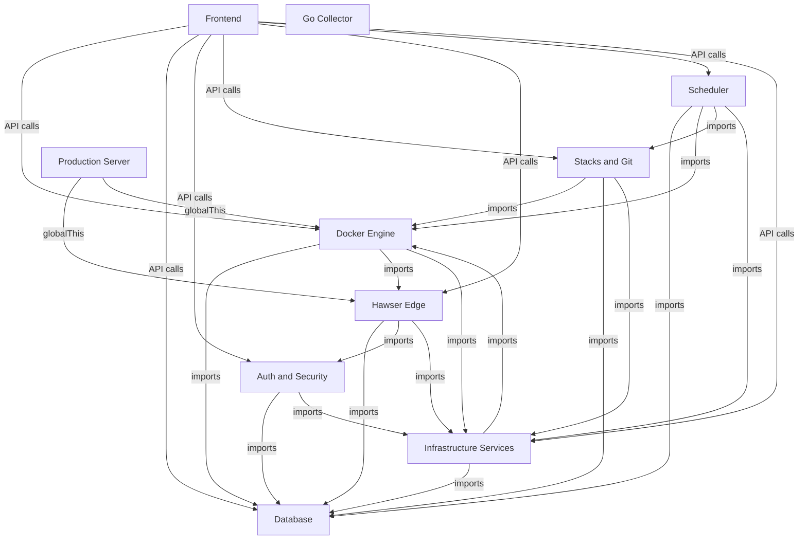

# Dependency Map

This document maps the inter-module dependencies across the Dockhand codebase. Each arrow represents a direct import or runtime dependency.

## Beginner

> [!tip] Prerequisites
> Before reading this section, you should be comfortable with:
> - What a "module" or "library" means in programming
> - The concept of dependencies (one piece of code using another)

### What Is This?

A dependency map shows which parts of the codebase rely on which other parts. If Module A imports functions from Module B, we say A *depends on* B. Understanding these relationships helps you know what might break when you change something, and where to look when tracing a bug.

### Key Concepts

**Direct dependency** — Module A directly imports and calls functions from Module B. These are the arrows in the diagram below.

**Transitive dependency** — Module A depends on B, and B depends on C. A indirectly depends on C, but doesn't import it directly.

**Leaf module** — A module with no dependencies on other project modules. The Go Collector is a leaf — it communicates via IPC, not imports.

### How It Works: Main Flow

The diagram below shows every direct dependency between Dockhand's 10 modules. Read it top-to-bottom: modules at the top depend on modules below them.

## Intermediate

### Design Rationale

The dependency graph reveals a layered architecture despite being a monolith:

1. **Foundation layer**: Database and Infrastructure Services sit at the bottom. Almost every module depends on them.
2. **Core services layer**: Docker Engine, Auth, and Hawser Edge provide the primary capabilities.
3. **Orchestration layer**: Stacks/Git and Scheduler compose the core services into higher-level workflows.
4. **Presentation layer**: Frontend and Production Server consume everything above.

The Go Collector is intentionally isolated — it has zero TypeScript imports and communicates exclusively via JSON IPC. This keeps the metrics collection path independent of Node.js module loading.

### Patterns Used

**Bidirectional dependency** — Docker Engine imports from Hawser Edge (`sendEdgeRequest`) and Hawser imports from Docker (indirectly via database). This is managed through dynamic imports (`await import('./docker.js')`) to avoid circular module resolution failures.

**globalThis bridge** — Production Server depends on Hawser and Docker, but through runtime function registration rather than static imports. This breaks what would otherwise be a circular dependency chain.

### Module Interactions

| Module | Depends On | Depended On By |
|--------|-----------|----------------|
| Database | Infrastructure Services | All except Go Collector |
| Infrastructure Services | Database, Docker Engine | All except Go Collector, Production Server |
| Docker Engine | Database, Hawser Edge, Infrastructure Services | Stacks, Scheduler, Frontend, Production Server, Infrastructure Services |
| Auth and Security | Database, Infrastructure Services | Hawser Edge, Frontend |
| Hawser Edge | Database, Auth, Infrastructure Services | Docker Engine, Production Server, Frontend |
| Stacks and Git | Docker Engine, Database, Infrastructure Services | Scheduler, Frontend |
| Scheduler | Database, Docker Engine, Stacks, Infrastructure Services | Frontend |
| Production Server | Hawser Edge, Docker Engine | — |
| Frontend | All server modules | — |
| Go Collector | — (IPC only) | — (IPC only) |

### Trade-offs

The bidirectional dependency between Docker Engine and Hawser Edge is a pragmatic choice: Docker needs to route requests through Hawser for edge environments, while Hawser needs Docker types for its protocol. Dynamic imports prevent module resolution cycles but make the dependency less visible at the type level.

## Advanced

### Concurrency & State

Cross-module state sharing happens through three mechanisms:

1. **Direct imports** — Singleton instances (EventEmitters, caches, Maps) exported from one module and imported by others. These share Node.js module-level state.
2. **globalThis** — Functions and Maps registered on the global object, primarily for HMR survival and server.js ↔ SvelteKit bridging.
3. **Database** — The canonical shared state. All modules read/write through `db.ts`, which serializes access via Drizzle ORM (and SQLite's WAL mode or PostgreSQL's connection pool).

### Failure Modes

- **Circular import at startup** — If dynamic imports are converted to static imports, Node.js will see incomplete module exports. The Docker ↔ Hawser cycle is the most fragile.
- **Module initialization order** — `hooks.server.ts` controls startup sequence: database first, then encryption migration, then subprocess manager, then scheduler. Reordering causes crashes (e.g., scheduler queries before DB is ready).
- **Cache coherence** — Docker client cache, metrics store, and Hawser connection map are all in-memory. A module that clears one cache without notifying dependents can cause stale reads.

### Invariants & Constraints

- Database must initialize before any other module performs queries. This is enforced by the `initDatabase()` call in `hooks.server.ts`.
- The Go Collector's IPC protocol is the only cross-process dependency. The JSON message format is the contract — changes require coordinated updates to both `collector/main.go` and `subprocess-manager.ts`.
- Infrastructure Services is the most widely depended-upon module. Changes to `encryption.ts`, `event-collector.ts`, or `metrics-store.ts` have blast radius across the entire application.
