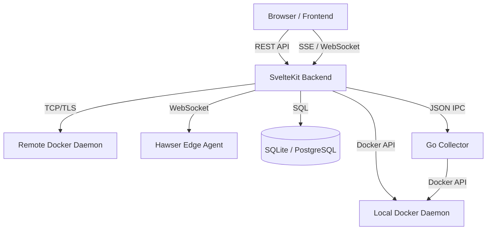
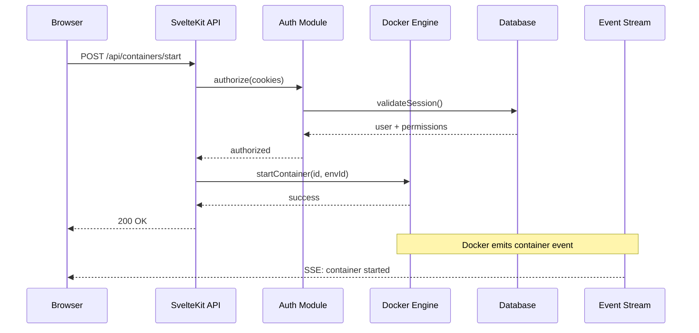

# System Overview

Dockhand is a container management UI built as a **modular monolith**. A single SvelteKit application serves both the web frontend and the REST/WebSocket API, backed by SQLite or PostgreSQL via Drizzle ORM. A companion Go binary handles metrics collection over IPC, and an optional updater sidecar manages self-updates.

## Beginner

> [!tip] Prerequisites
> Before reading this section, you should be comfortable with:
> - Basic web application concepts (frontend, backend, database)
> - What Docker containers are and why they need management
> - The idea of client-server architecture

### What Is This?

Dockhand is a web application that lets you manage Docker containers, images, volumes, and networks through a browser-based UI. Think of it as a dashboard for your Docker infrastructure — you can start, stop, inspect, and update containers, deploy multi-container stacks via Docker Compose, and monitor resource usage in real time.

The application is structured as a **monolith** — a single deployable unit that contains everything: the web pages users see, the API the pages talk to, and the background services that keep things running (scheduled updates, metrics collection, event streaming).

### Key Concepts

**SvelteKit** — A web framework that handles both the server-side (API routes, authentication) and client-side (interactive pages) of the application. It compiles to a Node.js server in production.

**Docker API** — Docker exposes an HTTP API (usually over a Unix socket) that programs can use to control containers. Dockhand calls this API directly instead of using a wrapper library.

**Multi-environment** — Dockhand can manage Docker daemons on multiple machines. Each "environment" is a connection to a different Docker host, whether local, remote via TCP/TLS, or via a Hawser Edge agent.

### How It Works: Main Flow

1. **User opens browser** — The SvelteKit frontend loads, authenticates the user via session cookies, and connects to a Server-Sent Events stream for real-time updates.
2. **User performs an action** — Clicking "start container" sends a REST API call to the SvelteKit backend.
3. **Backend calls Docker** — The API route handler calls the Docker Engine module, which routes the request to the correct Docker daemon (local socket, remote HTTPS, or Hawser Edge agent).
4. **Docker responds** — The response flows back through the API to the frontend. Meanwhile, Docker events stream through the Go collector or Hawser agent, keeping the dashboard updated in real time.

## Intermediate

### Design Rationale

Dockhand is a **modular monolith** rather than a microservices architecture. All server-side logic lives in one Node.js process, organized into clearly separated modules under `src/lib/server/`. This choice simplifies deployment (single container), eliminates inter-service networking, and keeps latency low for the interactive UI.

The decision to implement raw Docker API calls (no dockerode or similar library) gives full control over connection types, streaming, and error handling — important when supporting Unix sockets, TLS-pinned HTTPS, and WebSocket-relayed requests through Hawser agents.

### Patterns Used

**Direct Docker API Client** — Instead of wrapping a Docker client library, `docker.ts` implements HTTP requests directly using Node.js `http`/`https` modules and custom socket handling. This enables fine-grained control over connection pooling, stream demultiplexing, and transport routing.

**globalThis Bridge** — The production server (`server.js`) and the SvelteKit application communicate through functions registered on `globalThis`. This avoids tight coupling between the raw HTTP/WebSocket server and the application framework, while allowing WebSocket upgrade handling that SvelteKit doesn't natively support.

**Dual Database Support** — Drizzle ORM abstracts SQLite and PostgreSQL behind a shared query interface. The schema is defined twice (one per dialect) but operations in `db.ts` are dialect-agnostic. Runtime detection of `DATABASE_URL` selects the driver.

### Module Interactions

### Trade-offs

- **Single process** limits horizontal scaling but simplifies state management (in-memory caches, event emitters, subprocess coordination).
- **No external message queue** — events flow through in-process EventEmitters and SSE. This is simple but means events are lost if the server restarts.
- **Dual schema maintenance** — SQLite and PostgreSQL schemas must stay in sync manually. Migrations are separate per dialect.

## Advanced

### Concurrency & State

The Node.js event loop is the primary concurrency model. CPU-intensive work (Docker API polling, metrics aggregation) is offloaded to a Go subprocess communicating via JSON lines over stdin/stdout. The Go collector runs three goroutines per environment (metrics, events, disk checks) with semaphore-gated parallelism for container stats collection.

In-process state includes:
- **Docker client cache** — `Map<envId, DockerClientConfig>` with 30-minute TTL and periodic cleanup
- **HTTPS agent cache** — `Map<certHash, https.Agent>` keyed by certificate fingerprint for connection reuse with TLS rotation
- **Metrics ring buffer** — Fixed-size per-environment arrays with O(1) append, no GC pressure
- **Hawser connection map** — One active WebSocket per environment, with request/response correlation via `Map<requestId, PendingRequest>`
- **Stack locks** — Per-stack `Promise<void>` chains for serializing concurrent deployments

All caches use `globalThis` guards to survive Vite HMR reloads in development.

### Performance Characteristics

- **Docker API calls** are the primary latency source. Socket-based calls to a local daemon are sub-millisecond; Hawser Edge calls add WebSocket round-trip latency.
- **Database operations** are synchronous in SQLite (WAL mode, busy timeout 5s) and connection-pooled in PostgreSQL. The 250+ query functions in `db.ts` use Drizzle's chainable API with explicit field selection to avoid over-fetching.
- **SSE streaming** uses chunked transfer encoding. Container stats are streamed as line-delimited JSON, not standard SSE framing.
- **Gzip compression** is applied in the hooks middleware for responses >1KB with compatible content types.

### Failure Modes

- **Docker daemon unreachable** — The Go collector retries with exponential backoff (5s–60s). The UI shows the environment as offline. API calls return `DockerConnectionError` with user-friendly messages.
- **Database locked** (SQLite) — WAL mode with 5-second busy timeout mitigates most contention. Long-running scans or bulk operations can still trigger `SQLITE_BUSY`.
- **Hawser agent disconnect** — Pending requests are rejected with "connection lost." Reconnection throttling prevents storms (30s→300s escalating cooldown).
- **Subprocess crash** — The Go collector is restarted automatically. Metrics collection pauses until the new process signals ready.

> [!danger] Critical Failure Mode
> If the encryption key (`ENCRYPTION_KEY` env var or file) is lost or changed without migration, all encrypted credentials (registry passwords, TLS keys, Hawser tokens, Git credentials) become unreadable. The `migrateCredentials()` function handles key rotation, but only if the old key is still available in the key file while the new key is in the env var.

### Invariants & Constraints

- The Go collector must be compiled and present at `collector/main` for metrics/events collection. If missing, the subprocess manager logs an error but the server continues without real-time metrics.
- `server.js` must start before SvelteKit registers its `globalThis` handlers. Fallback logic in `server.js` uses the local Docker socket if SvelteKit isn't ready yet.
- Database migrations run automatically on startup. A failed migration leaves the database in an indeterminate state — there is no automatic rollback.
- The encryption module lazy-initializes on first use. If crypto operations fail before initialization (e.g., during migration), the server cannot start.
