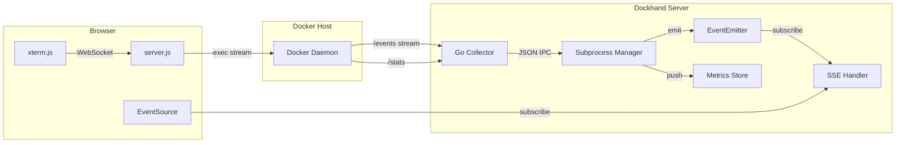

# Real-Time Communication

How events, metrics, and terminal data flow in real time across all layers — from Docker daemon to browser.

## Beginner

> [!tip] Prerequisites
> Before reading this section, you should understand:
> - Server-Sent Events (SSE) — one-way server-to-browser streaming
> - WebSockets — bidirectional persistent connections
> - The idea of event-driven architectures

### What Is This?

Dockhand's dashboard updates in real time: containers appear when started, stats refresh every 30 seconds, and terminal sessions stream keystrokes and output live. This document explains the communication channels that make this work.

## Intermediate

### Communication Channels

### Four Real-Time Paths

| Path | Transport | Direction | Purpose |
|------|-----------|-----------|---------|
| Docker events → Browser | Go IPC → EventEmitter → SSE | Server → Client | Container lifecycle events |
| Container metrics → Browser | Go IPC → Ring Buffer → API poll | Server → Client | CPU/memory stats |
| Terminal I/O | WebSocket → Docker exec stream | Bidirectional | Interactive container shell |
| Hawser agent ↔ Server | WebSocket | Bidirectional | Remote Docker management |

### Event Flow Detail

1. **Docker emits event** (container start/stop/etc.)
2. **Go Collector** receives it on the `/events` stream or poll
3. **Subprocess Manager** parses the JSON line and emits on `containerEventEmitter`
4. **SSE Handler** (`/api/events`) has a listener that serializes the event and writes it to the SSE response stream
5. **Browser EventSource** receives the event and dispatches to the events store
6. **Svelte store** updates, triggering reactive UI updates

### Edge Environment Variant

For environments managed through Hawser Edge agents, the flow differs:
- Events arrive via WebSocket messages (not Go collector IPC)
- The Hawser module emits on the same `containerEventEmitter`
- SSE handler doesn't distinguish between local and edge events — same downstream path

## Advanced

### Backpressure

- **SSE**: No explicit backpressure. If the browser can't consume events fast enough, the server buffers them in the HTTP response stream. This is bounded by the Node.js stream high-water mark.
- **Terminal WebSocket**: No flow control. Docker exec output is relayed as fast as it arrives. Fast-producing commands (e.g., `cat /dev/urandom`) can overwhelm the browser.
- **Go collector**: Stats collection is semaphore-gated (8 concurrent). The collector won't flood the IPC channel because it only sends one aggregated metrics message per interval.

### Connection Lifecycle

- **SSE**: Opened on page load, closed on environment switch (then reopened). 5-attempt reconnection with 3s delay.
- **Terminal WebSocket**: Opened when user opens terminal tab, closed when tab closes or container stops.
- **Hawser WebSocket**: Persistent, with 5-second ping/pong keepalive and 90-second idle timeout.
- **Go collector IPC**: Persistent for process lifetime. If the collector crashes, the subprocess manager detects the exit and can restart.

### Failure Isolation

Each channel fails independently:
- SSE disconnect → Dashboard stops updating, but API calls still work
- Terminal WebSocket close → Terminal session ends, but other features unaffected
- Hawser disconnect → Edge environment goes offline, but local environments continue
- Go collector crash → Metrics pause, but events from Hawser environments still flow
