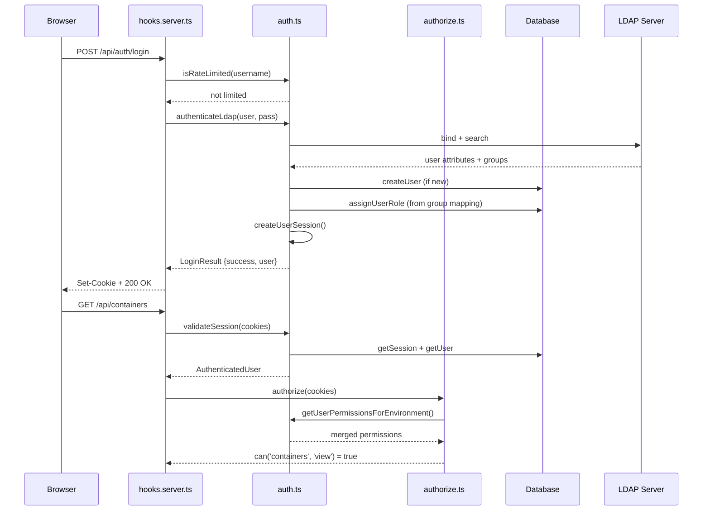

# Auth and Security

Authentication (local, LDAP, OIDC), authorization (RBAC), MFA, rate limiting, AES-256-GCM encryption, and enterprise audit logging.

## Beginner

> [!tip] Prerequisites
> Before reading this section, you should be comfortable with:
> - What authentication (proving who you are) and authorization (what you can do) mean
> - The concept of sessions and cookies in web applications
> - Password hashing (storing passwords safely)

### What Is This?

This module handles everything related to security in Dockhand. It answers two questions for every request: "Who are you?" (authentication) and "Are you allowed to do this?" (authorization).

It supports three ways to log in: local passwords, LDAP (corporate directory), and OIDC/SSO (single sign-on with providers like Keycloak or Azure AD). It also provides multi-factor authentication (MFA) with authenticator apps, rate limiting to prevent brute-force attacks, and encryption for storing sensitive data at rest.

### Key Concepts

**Argon2id** — A modern password hashing algorithm. When you set a password, it's hashed with Argon2id (64MB memory cost) before storage. Even if someone steals the database, they can't reverse the hash to get your password.

**Session cookie** — After logging in, the server creates a session record in the database and sends a secure, HTTP-only cookie to the browser. Every subsequent request includes this cookie, which the server uses to identify you without re-entering your password.

**RBAC (Role-Based Access Control)** — In the enterprise edition, permissions are grouped into roles (Admin, Operator, Viewer, or custom). Users are assigned roles, and each role grants specific permissions (e.g., "can start containers in environment X").

### How It Works: Main Flow

1. **Login** — User submits username and password. The module checks rate limiting, then authenticates against local DB, LDAP, or OIDC.
2. **Session created** — On success, a session is stored in the database and a secure cookie is set.
3. **Request arrives** — `hooks.server.ts` calls `validateSession(cookies)` for every request. If valid, the user is attached to the request context.
4. **Permission check** — API routes call `authorize(cookies)` which returns a fluent API: `auth.can('containers', 'start', envId)`.

> [!example] Example
> ```typescript
> // In an API route
> const auth = await authorize(cookies);
> if (!await auth.can('containers', 'start', envId)) {
>   return forbidden('Cannot start containers');
> }
> ```

## Intermediate

### Design Rationale

The auth module is split into two complementary files: `auth.ts` (1,532 lines) handles credential verification and session management, while `authorize.ts` (256 lines) provides a clean authorization facade. This separation keeps the complex authentication logic (LDAP, OIDC, MFA) isolated from the simpler permission-checking pattern used by 190+ API routes.

The free edition treats all authenticated users as admins — there's no RBAC overhead. The enterprise edition enables fine-grained permissions scoped by resource type and environment, with role-based permission merging.

### Patterns Used

**Fluent Authorization API** — `authorize(cookies)` returns an object with chainable methods: `.can(resource, action, envId)`, `.canManageUsers()`, `.canAccessEnvironment(envId)`. This makes permission checks readable and consistent across all API routes.

**Provider Abstraction** — Login attempts are dispatched to `authenticateLocal()`, `authenticateLdap()`, or OIDC callback handling. Each provider follows the same contract: accept credentials, return a `LoginResult` with user info or error. User provisioning (create-on-first-login) is built into both LDAP and OIDC flows.

**PKCE Flow (OIDC)** — OIDC authentication uses Proof Key for Code Exchange with S256 challenge method, state/nonce tracking (10-minute expiry), and discovery document caching (1-hour TTL).

### Module Interactions



### Trade-offs

- **In-memory rate limiting** — Rate limit state is lost on server restart, meaning a brute-force attacker gets a fresh start. A Redis-backed alternative would persist across restarts but adds infrastructure complexity.
- **MFA backup codes are SHA256-hashed** — Single-use, 8-character codes. Lost backup codes cannot be recovered; admin must disable and re-enable MFA for the user.
- **OIDC basic token validation** — The module validates nonce and extracts claims but does not verify JWT signatures against the provider's JWKS endpoint. This is acceptable for server-side flows where the token comes directly from the provider over TLS.

## Advanced

### Concurrency & State

Three global in-memory stores (all HMR-guarded via `globalThis`):
- **Rate limit map** — `Map<identifier, {attempts, lastAttempt, lockedUntil}>`, auto-cleaned every 5 minutes
- **OIDC state store** — `Map<state, {codeVerifier, nonce, redirectUrl, timestamp}>`, 10-minute TTL
- **Discovery cache** — `Map<configId, {document, fetchedAt}>`, 1-hour TTL

### Performance Characteristics

- **Argon2id** — 64MB memory cost per hash operation. Login latency is dominated by this (~100-300ms per verification). Configured via the `argon2` native binding.
- **LDAP** — Opens a new connection per authentication attempt (no connection pooling). Group membership queries add a second LDAP round-trip.
- **Permission resolution** — Merges permissions from all assigned roles. For users with many roles in many environments, this involves multiple DB queries. No caching of resolved permissions.

### Failure Modes

- **LDAP server unreachable** — Returns a generic "Invalid credentials" error (same as wrong password) to prevent information leakage about which auth providers are configured.
- **OIDC provider down** — Discovery document cache (1 hour) masks short outages. If the cache is cold and the provider is down, login fails with a provider-specific error.
- **Argon2 native module missing** — Falls back to Node.js crypto for password hashing, which is significantly slower and less secure.

> [!danger] Critical Failure Mode
> The LDAP filter for user search uses `escapeLdapFilterValue()` to prevent LDAP injection. If this escaping is bypassed or incomplete, an attacker could manipulate LDAP queries to authenticate as any user.

### Invariants & Constraints

- Session cookies are `HttpOnly`, `SameSite=Strict`, and conditionally `Secure` (based on `x-forwarded-proto` or `COOKIE_SECURE` env var).
- Authentication failures always return generic messages ("Invalid username or password") regardless of whether the user exists, preventing user enumeration.
- Rate limiting triggers after 5 failed attempts within 15 minutes, imposing a 15-minute lockout.
- The encryption key is lazy-initialized. If a rotation is detected (env var differs from file), `migrateCredentials()` re-encrypts all sensitive fields in the database.
