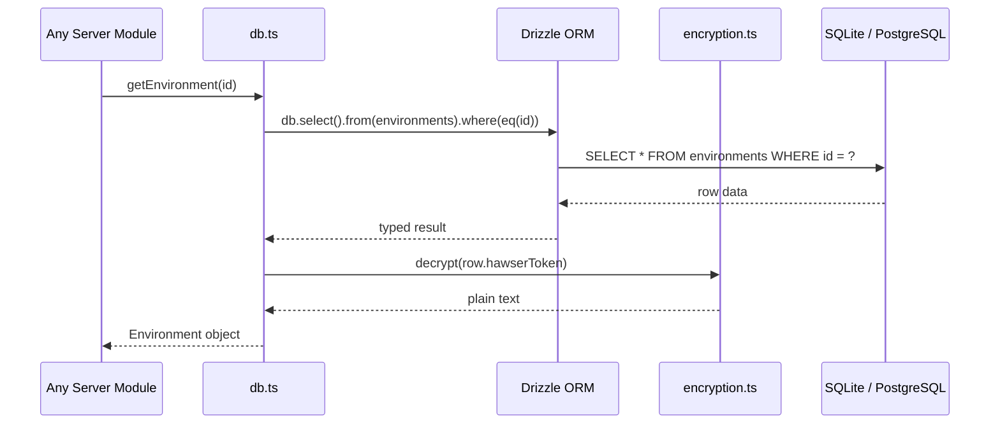

# Database

The data access layer — 250+ exported functions over Drizzle ORM, supporting both SQLite and PostgreSQL with transparent encryption of sensitive fields.

## Beginner

> [!tip] Prerequisites
> Before reading this section, you should be comfortable with:
> - What a database is and why applications store data
> - Basic SQL concepts (tables, rows, queries)
> - The idea of an ORM (Object-Relational Mapping)

### What Is This?

This module is how Dockhand stores and retrieves all its data: environments, users, containers, stacks, settings, audit logs, and more. It wraps a database (either SQLite for simple setups or PostgreSQL for larger deployments) with TypeScript functions that handle encryption, querying, and data transformation.

Think of it as the memory of the application — every setting you configure, every user you create, and every event that happens gets recorded through this module.

### Key Concepts

**Drizzle ORM** — A TypeScript library that lets you write database queries using JavaScript objects instead of raw SQL strings. It generates the SQL for you and returns typed results.

**Dual database support** — At startup, the module detects whether a `DATABASE_URL` environment variable exists. If it does, PostgreSQL is used; otherwise, SQLite (a single file on disk) is the default.

**Transparent encryption** — Sensitive fields like passwords, API tokens, and TLS keys are automatically encrypted before being written to the database and decrypted when read back. You call `getEnvironment()` and get plain text; the encryption is invisible.

### How It Works: Main Flow

1. **Startup** — `initDatabase()` is called from `hooks.server.ts`. This triggers lazy initialization of the database connection, runs pending migrations, and seeds default data (admin role, registries, cleanup schedules).
2. **Query** — A server module calls e.g., `getEnvironment(id)`. The function uses Drizzle to `SELECT` from the environments table, then decrypts any encrypted fields before returning.
3. **Write** — A module calls e.g., `createUser(data)`. The function encrypts sensitive fields, then uses Drizzle to `INSERT` the row.

> [!example] Example
> ```typescript
> // Get all environments
> const envs = await getEnvironments();
>
> // Create a new user
> const user = await createUser({
>   username: 'admin',
>   password: hashedPassword,
>   displayName: 'Administrator'
> });
> ```

## Intermediate

### Design Rationale

The module consolidates all database operations into a single 4,681-line file (`db.ts`) rather than splitting into per-entity repositories. This is a pragmatic choice for a monolith — there's no service boundary that would benefit from separation, and having all queries in one file makes it easy to find and reuse query patterns. The trade-off is a large file that can be hard to navigate.

Dual database support via Drizzle avoids vendor lock-in while keeping the query layer dialect-agnostic. The schema is maintained in two files (`schema/index.ts` for SQLite, `schema/pg-schema.ts` for PostgreSQL) with separate migration directories.

### Patterns Used

**Encryption Wrapper** — Every function that reads sensitive data calls `decrypt()` on the relevant fields. Every function that writes sensitive data calls `encrypt()`. This is applied consistently to: environment TLS keys, Hawser tokens, registry passwords, LDAP bind passwords, OIDC client secrets, git credentials (passwords, SSH keys, passphrases), and notification configs.

**Lazy Initialization with Proxy** — The database connection is initialized lazily on first use via a proxy pattern in `drizzle.ts`. This allows the module to be imported without triggering a connection, which is useful during build and test phases.

**Seeding on Startup** — `seedDatabase()` in `drizzle.ts` creates default registries (Docker Hub, GHCR, Quay, ECR), system roles (Admin, Operator, Viewer), and cleanup cron schedules if they don't already exist.

### Module Interactions



### Trade-offs

- **Single file** — All 250+ functions in one file. Easy to grep, hard to navigate. No per-entity encapsulation.
- **Dual schema maintenance** — SQLite and PostgreSQL schemas must be kept in sync manually. There is no automated check that they define the same tables and columns.
- **No query caching** — Every call hits the database. For SQLite with WAL mode this is fast; for PostgreSQL, connection pooling mitigates overhead.

## Advanced

### Concurrency & State

**SQLite** — Configured with WAL mode, `synchronous=NORMAL`, and a 5-second busy timeout. WAL allows concurrent readers but only one writer. Heavy write contention (e.g., bulk event logging during a deployment) can trigger `SQLITE_BUSY` errors.

**PostgreSQL** — Uses the `postgres` driver with connection pooling. Concurrent queries are multiplexed across pool connections. No explicit transaction isolation level is set — defaults to READ COMMITTED.

**Lazy initialization** — The `db` export is a Proxy that triggers connection setup on first property access. This means the first query in a cold start has extra latency from connection + migration checks.

### Performance Characteristics

- **28 tables** with 15+ relationships and unique constraints.
- **No indexes beyond primary keys and unique constraints** are explicitly defined in the schema files. Query performance on large datasets (thousands of audit logs, container events) depends on the database engine's default indexing.
- **Encryption overhead** — Each encrypt/decrypt call involves AES-256-GCM with a fresh IV. For reads that return many rows with encrypted fields (e.g., listing all environments), this adds per-row crypto overhead.

### Failure Modes

- **Migration failure** — Migrations run automatically on startup. A failed migration leaves the database in an indeterminate state. There is no automatic rollback; manual intervention is required.
- **Encryption key unavailable** — If `encrypt()` or `decrypt()` is called before the key is initialized (or with a wrong key), it returns `null`. Functions handle this by passing through the value unchanged, which means sensitive data may be stored in plain text or read as garbled text.
- **Schema health check** — `checkSchemaHealth()` validates that expected tables exist and have the right columns. If validation fails, the server logs a warning but continues running.

> [!danger] Critical Failure Mode
> If the encryption key changes without running `migrateCredentials()`, all previously encrypted fields become unreadable. Functions that call `decrypt()` on these fields will return `null`, causing silent data loss for passwords, tokens, and TLS keys.

### Invariants & Constraints

- The database must be initialized before any query. Enforced by the lazy proxy pattern — accessing any Drizzle method triggers init.
- Sensitive fields are always encrypted on write if the encryption module is initialized. If encryption is unavailable, fields are stored in plain text.
- The `id` column on all tables is auto-incrementing integer. No UUID primary keys.
- Session tokens are stored as plain strings (not encrypted) since they are already cryptographically random.
