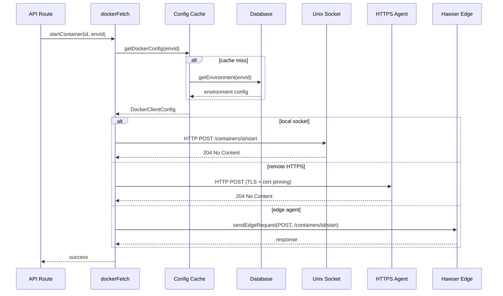

# Docker Engine

The core Docker API client — 5,264 lines implementing raw HTTP requests to Docker daemons over multiple transport types.

## Beginner

> [!tip] Prerequisites
> Before reading this section, you should be comfortable with:
> - What Docker is and what containers do
> - HTTP requests and responses
> - Unix sockets as a communication mechanism

### What Is This?

This module is Dockhand's way of talking to Docker. Instead of using a pre-built Docker client library, it speaks the Docker HTTP API directly — sending HTTP requests over Unix sockets, TCP connections, or WebSocket relays.

Every container operation you see in the UI (start, stop, create, inspect, view logs) ultimately calls a function in this module, which translates the operation into a Docker API HTTP request.

### Key Concepts

**Unix socket** — A file (usually `/var/run/docker.sock`) that allows processes on the same machine to communicate. Docker listens on this socket for API requests.

**Transport routing** — The module decides *how* to reach Docker based on the environment configuration: local socket for same-machine, HTTPS for remote daemons with TLS certificates, or WebSocket relay for Hawser Edge agents.

**Stream demultiplexing** — Docker sends container logs and exec output in a binary frame format (type byte + size + payload). This module parses those frames to extract clean output.

### How It Works: Main Flow

1. **Caller invokes an operation** — e.g., `startContainer(id, envId)`.
2. **`dockerFetch` dispatches** — Looks up the environment's connection config and routes to the correct transport (socket, HTTPS, or Hawser).
3. **HTTP request sent** — A properly formatted Docker API request is constructed and sent.
4. **Response processed** — JSON responses are parsed; streaming responses are demultiplexed and returned as `ReadableStream`.

> [!example] Example
> ```typescript
> // Start a container in the default environment
> await startContainer('abc123', 1);
>
> // List all containers (including stopped)
> const containers = await listContainers(true, 1);
> ```

## Intermediate

### Design Rationale

The decision to bypass wrapper libraries (dockerode, etc.) is intentional. Dockhand needs to support three fundamentally different transports — Unix socket, HTTPS with certificate pinning, and WebSocket relay — with unified error handling and streaming. No existing library supports all three, especially the Hawser relay path where Docker API requests are serialized as JSON messages over a WebSocket.

### Patterns Used

**Transport Adapter** — `dockerFetch` is the central dispatch function. It accepts a path, options, and environment ID, then routes to `unixSocketRequest`, `httpsAgentRequest`, or `sendEdgeRequest` based on the environment's connection type. This keeps all 100+ API functions transport-agnostic.

**Atomic Update with Rollback** — `updateContainer` implements a safe rename-and-recreate pattern: inspect → stop → rename to `-old` → create new → start new → remove old. On failure, it rolls back by reconnecting networks and restarting the old container.

### Module Interactions



### Trade-offs

- **No library abstraction** means every Docker API feature must be hand-implemented. This is more work but gives complete control over streaming, error handling, and transport selection.
- **Client config caching** (30-minute TTL) means environment changes in the database won't take effect immediately. `clearDockerClientCache(envId)` must be called explicitly.
- **Path traversal validation** in `dockerFetch` adds a security boundary but restricts dynamic path construction.

## Advanced

### Concurrency & State

Two in-memory caches with TTL-based cleanup:
- `envCache: Map<envId, {env, lastUsed}>` — environment configs, 30-minute TTL
- `agentCache: Map<certHash, {agent, lastUsed}>` — `https.Agent` instances keyed by certificate hash for connection reuse with TLS rotation

Both use `globalThis` interval guards for HMR-safe cleanup. Cache entries are lazily evicted every 5 minutes.

### Performance Characteristics

- **Socket requests** have minimal overhead — direct HTTP over Unix domain socket.
- **HTTPS requests** pool connections via `https.Agent` with `maxSockets: 10`. Certificate hash-based keying ensures new agents are created when certs rotate.
- **Edge requests** add WebSocket serialization overhead plus round-trip latency. Binary data is base64-encoded, increasing payload size ~33%.
- **Stream demuxing** processes binary frames with UTF-8 boundary reassembly, handling multi-byte characters split across Docker frames (observed on Synology NAS hardware).

### Failure Modes

- **`ECONNREFUSED`/`ENOENT`** — Docker daemon not running or socket not found. Wrapped as `DockerConnectionError` with user-friendly message.
- **`ETIMEDOUT`** — Remote Docker daemon unreachable. 30-second default timeout.
- **Stream frame corruption** — If Docker sends malformed frames, the demuxer falls back to raw buffer interpretation and logs a diagnostic warning.
- **`updateContainer` mid-failure** — If the new container fails to start, rollback reconnects networks and restarts the old (renamed) container. If rollback itself fails, both containers may exist in a broken state.

> [!danger] Critical Failure Mode
> The `createContainer` function constructs a 115+ field Docker API payload. Missing or malformed fields silently produce containers with wrong configurations. There is no pre-flight validation against the Docker API schema — errors are only caught at runtime.

### Invariants & Constraints

- All Docker resource IDs from URL parameters are validated by `validateDockerIdParam` (21-line module) for path traversal sequences before use.
- The `dockerFetch` function validates that API paths don't contain `..` segments.
- `extractContainerOptions` must faithfully reconstruct `CreateContainerOptions` from inspect output for the update flow to be lossless. Any new Docker API field added to container creation must also be added to extraction.
