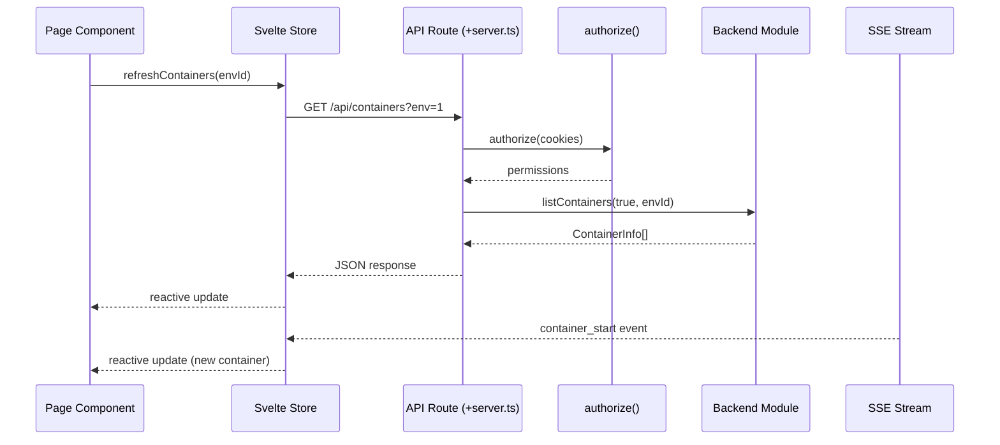

# Frontend

SvelteKit web application with 18 page routes, 192 API endpoints, real-time event streaming, and shadcn-svelte component library.

## Beginner

> [!tip] Prerequisites
> Before reading this section, you should be comfortable with:
> - What a web framework is (renders pages, handles requests)
> - HTML, CSS, and basic JavaScript
> - The concept of a single-page application (SPA)

### What Is This?

The Frontend module is everything the user sees and interacts with in their browser, plus the API endpoints that power it. It's built with SvelteKit, a web framework that handles both:

- **Server-side** — API routes (`/api/...`) that talk to the Docker Engine, Database, and other backend modules.
- **Client-side** — Interactive pages rendered in the browser with real-time updates.

The UI uses shadcn-svelte (a component library based on Tailwind CSS) for consistent styling, and xterm.js for the in-browser terminal.

### Key Concepts

**SvelteKit routing** — Pages are defined by file paths. `src/routes/containers/+page.svelte` becomes the `/containers` page. API endpoints use `+server.ts` files under `src/routes/api/`.

**Svelte stores** — Reactive state containers that update the UI automatically when their data changes. The container list, authentication state, and theme preferences are all managed by stores.

**Server-Sent Events (SSE)** — A one-way streaming connection from the server to the browser. When Docker events occur (container started, stopped, etc.), the server pushes them to the browser in real time via SSE.

### How It Works: Main Flow

1. **Page loads** — SvelteKit renders the page on the server, checks authentication, and sends HTML to the browser.
2. **Client hydrates** — The browser takes over, initializing stores, connecting SSE for real-time events, and fetching initial data.
3. **User interacts** — Actions (start container, deploy stack) trigger API calls to `/api/...` endpoints.
4. **API processes** — The endpoint checks permissions, calls backend modules (Docker, Database, etc.), and returns JSON.
5. **Real-time updates** — Docker events push through SSE, triggering store updates and UI re-renders.

> [!example] Example
> ```typescript
> // In a Svelte component
> import { containerStore } from '$lib/stores/containers';
>
> // Refresh containers for the current environment
> await containerStore.refreshContainers(envId);
>
> // React to Docker events
> import { onDockerEvent } from '$lib/stores/events';
> const unsubscribe = onDockerEvent((event) => {
>   console.log('Container event:', event.Action);
> });
> ```

## Intermediate

### Design Rationale

SvelteKit was chosen for its server-side rendering (SSR) capabilities combined with client-side interactivity. The same framework handles both the REST API and the page rendering, eliminating the need for a separate API server.

The 192 API endpoints follow a consistent pattern: authenticate → authorize → call backend module → return JSON. This repetition is intentional — each endpoint is self-contained and easy to understand in isolation, even if the authorization boilerplate is verbose.

Stores use Svelte's writable/derived pattern with additional methods for data fetching and cache management. The environment store drives the entire application — switching environments invalidates container, stats, and event data.

### Patterns Used

**Data Loading Pattern** — Pages call `store.refresh(envId)` on mount. Stores fetch from API endpoints with the environment as a query parameter. Loading state is managed via skeleton UI components. Cache invalidation happens on environment switch.

**Real-time Event Pattern** — Docker events flow through SSE at `/api/events?env={envId}`. The events store manages the EventSource connection with reconnection logic (5 attempts, 3s delay, exponential backoff). Edge environments receive events through the Hawser WebSocket instead.

**Authorization Guard Pattern** — Every API endpoint follows:
```typescript
const auth = await authorize(cookies);
if (auth.authEnabled && !await auth.can(resource, action, envId)) {
  return json({ error: 'Permission denied' }, { status: 403 });
}
```

**Environment-Scoped State** — The current environment is stored in a writable store and persisted to localStorage. Changing the environment triggers a cascade: containers refresh, SSE reconnects, stats reset, dashboard updates.

### Module Interactions



### Trade-offs

- **192 individual endpoint files** — Each API endpoint is a separate `+server.ts` file. This is verbose but makes each endpoint self-contained and easy to locate by URL path.
- **No API client layer** — Stores call `fetch()` directly with inline URL construction. A shared API client would reduce duplication but add a layer of indirection.
- **localStorage for environment selection** — Fast but not synced across devices. A database-backed preference would persist across browsers but add latency.

## Advanced

### Concurrency & State

**Client-side state model:**
- Stores are singleton modules (Svelte store pattern). Multiple components subscribe to the same store instance.
- SSE connection is global — one EventSource per session, reconnected on environment switch.
- localStorage reads are synchronous and blocking. Used for theme, environment selection, and grid layout preferences.

**Server-side:**
- `hooks.server.ts` runs as middleware on every request. It initializes the database (once), validates sessions, applies gzip compression, and handles rate limiting.
- API routes are stateless — all state comes from the database or backend module singletons.
- The startup sequence in `hooks.server.ts` is ordered: database init → encryption migration → subprocess start → scheduler start → RSS tracker start.

### Performance Characteristics

- **Gzip compression** — Applied to JSON, HTML, CSS, JS, SVG, XML responses >1KB. Skipped for event-stream and binary content types.
- **SSE reconnection** — 5 attempts with 3-second delay. After exhaustion, manual reconnection required (environment switch or page reload).
- **Container stats streaming** — Uses a dedicated streaming endpoint that sends line-delimited JSON, not standard SSE framing. This reduces overhead for high-frequency data.
- **Dashboard** — Tile data is cached per environment with progressive loading. Grid layout preferences are persisted to the database for cross-device sync (enterprise) or localStorage (free).

### Failure Modes

- **Auth session expired** — API routes return 401. The auth store detects this and redirects to `/login?redirect=...`.
- **Environment deleted** — API returns 404 for the environment. The store clears the stale environment from localStorage and redirects to the dashboard.
- **SSE connection lost** — Reconnection logic fires. If all 5 attempts fail, the UI stops receiving real-time updates but remains functional via manual refresh.
- **Docker connection error** — API routes catch `DockerConnectionError` and return a user-friendly error message. The UI displays it as a toast notification.

### Invariants & Constraints

- Authentication is checked on every request in `hooks.server.ts`. Public paths (login, health, webhooks) are explicitly whitelisted.
- The startup sequence in hooks must complete before any API route can handle requests. Lazy database initialization handles the timing.
- shadcn-svelte components in `src/lib/components/ui/` are generated code — they should be updated via the shadcn-svelte CLI, not edited directly.
- 18 page routes correspond to sidebar navigation items. Adding a new page requires adding both the route and the sidebar entry.
