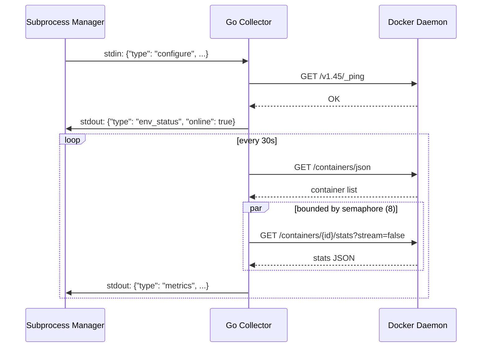

# Go Collector

A Go subprocess for collecting Docker metrics and events via IPC with the Node.js server, using only the standard library.

## Beginner

> [!tip] Prerequisites
> Before reading this section, you should be comfortable with:
> - What a subprocess is (a separate program started by another program)
> - Basic Docker concepts (containers, images, events)
> - The idea of inter-process communication (two programs exchanging messages)

### What Is This?

The Go Collector is a small, compiled program written in Go that runs alongside the main Dockhand Node.js server. Its job is to efficiently poll Docker daemons for:

- **Metrics** — CPU and memory usage of all running containers, collected every 30 seconds.
- **Events** — Docker events (container started, stopped, etc.) streamed in real time.
- **Disk usage** — Storage consumption reported every 5 minutes.

It communicates with the Node.js server through JSON messages on stdin/stdout — no network sockets, no HTTP, just simple text lines.

### Key Concepts

**IPC (Inter-Process Communication)** — The Node.js server spawns the Go collector as a child process. They exchange JSON objects: the server sends commands on the collector's stdin, and the collector sends results on its stdout.

**Per-environment model** — Each Docker environment (local or remote) gets its own set of goroutines (lightweight threads) for metrics, events, and disk checks. Adding a new environment spins up three new goroutines; removing one cancels them.

**Standard library only** — The collector has zero external dependencies. Everything — HTTP clients, TLS, JSON, concurrency — uses Go's standard library. This keeps the binary small and eliminates supply chain risk.

### How It Works: Main Flow

1. **Server starts collector** — Node.js spawns the Go binary and reads its stdout.
2. **Collector sends `ready`** — Signals it's initialized and waiting for commands.
3. **Server sends `configure`** — Provides Docker connection details for each environment.
4. **Collector starts polling** — Three goroutines per environment: metrics (30s), events (stream or poll), disk (5min).
5. **Results flow back** — Metrics, events, and disk usage are written as JSON lines to stdout, read by the subprocess manager.

> [!example] Example
> ```json
> // Server → Collector (configure an environment)
> {"type": "configure", "id": "env-1", "config": {"type": "socket", "socketPath": "/var/run/docker.sock"}}
>
> // Collector → Server (metrics result)
> {"type": "metrics", "id": "env-1", "cpu": 12.5, "memory": 45.2, "memoryUsed": 1073741824, "memoryTotal": 4294967296, "cpuCount": 4}
> ```

## Intermediate

### Design Rationale

Docker metrics collection requires frequent HTTP calls to per-container `/stats` endpoints. In Node.js, this would consume event loop time and create garbage collection pressure from thousands of JSON parse/stringify cycles. Go handles this more efficiently with goroutines and lower-overhead JSON processing.

The decision to use only the standard library is deliberate — the collector is compiled into a static binary that's included in the Docker image. Zero dependencies means zero supply chain risk and no `go.sum` to maintain.

### Patterns Used

**Manager/Environment Model** — A central `manager` struct holds a `sync.Mutex`-protected map of `environment` objects. Each environment owns its goroutines and cancellation context. The manager serializes all mutations and uses a dedicated `sync.Mutex` for stdout writes.

**Semaphore-Gated Parallelism** — Per-container stats collection uses a channel-based semaphore (`chan struct{}` with capacity 8) to bound concurrent Docker API calls. This prevents overwhelming the daemon when many containers are running.

**Exponential Backoff (Events)** — Event streaming reconnects with exponential backoff: 5s → 10s → 20s → 40s → 60s (max). Resets to 5s on successful connection.

### Module Interactions



### Trade-offs

- **Monolithic file** — All 949 lines in a single `main.go`. No packages, no interfaces. Simple to understand but hard to unit test.
- **JSON IPC** — Human-readable but less efficient than protobuf or msgpack. Adequate for the message volume (~1 message per environment per 30 seconds).
- **No persistence** — If the collector crashes, all in-flight metrics are lost. The subprocess manager restarts it, but there's a gap in metrics history.

## Advanced

### Concurrency & State

Three goroutines per environment, all tied to a cancellable `context.Context`:

1. **Metrics goroutine** — `time.Ticker` at configurable interval (default 30s). Spawns bounded worker pool for per-container stats. Results aggregated synchronously after all workers complete (`sync.WaitGroup`).
2. **Events goroutine** — Either streams `/events?type=container` (long-lived HTTP response, `bufio.Scanner`) or polls at intervals. A companion goroutine force-closes the response body on context cancellation to prevent scanner deadlock.
3. **Disk goroutine** — `time.Ticker` at 5-minute interval. Fetches `/system/df` (capped at 10MB) and `/info` (capped at 2MB) with `io.LimitReader`.

**Synchronization:**
- `manager.mu` — Protects environment map mutations
- `manager.outMu` — Serializes JSON writes to stdout (prevents interleaved output)
- Per-goroutine: only local state (no shared mutation)

### Performance Characteristics

- **Memory** — Two HTTP clients per environment (standard + streaming), each with tuned connection pools. Standard: 16 max idle, 90s timeout. Streaming: 4 max idle, no timeout.
- **CPU normalization** — CPU percentage divided by CPU count for per-core percentage. Guards against NaN/Inf before serializing.
- **Memory normalization** — Inactive file cache subtracted from usage to avoid inflated numbers.
- **Buffer sizing** — `bufio.Scanner` uses 64KB initial / 1MB max buffer for all streaming reads.

### Failure Modes

- **Docker daemon unreachable** — Reports `env_status: offline` with error reason. Metrics/events goroutines continue retrying on their regular intervals.
- **Goroutine leak prevention** — The events goroutine spawns a companion that force-closes the HTTP response body on context cancellation. Without this, `scanner.Scan()` would block indefinitely if the transport's cancel watcher doesn't fire.
- **Transport cleanup** — `closeTransports()` is called on environment removal, explicitly closing both HTTP transports and their idle connections.

### Invariants & Constraints

- The collector is a single-file Go program with no external dependencies. Only `go build` is needed.
- Communication is strictly via JSON lines on stdin/stdout. No network listeners, no file I/O, no signal-based IPC.
- SIGTERM/SIGINT trigger graceful shutdown: all environments are removed (goroutines cancelled, transports closed), then the process exits.
- The collector trusts all Docker connection details from the parent process. No validation of socket paths or TLS certificates beyond what Go's standard library provides.
