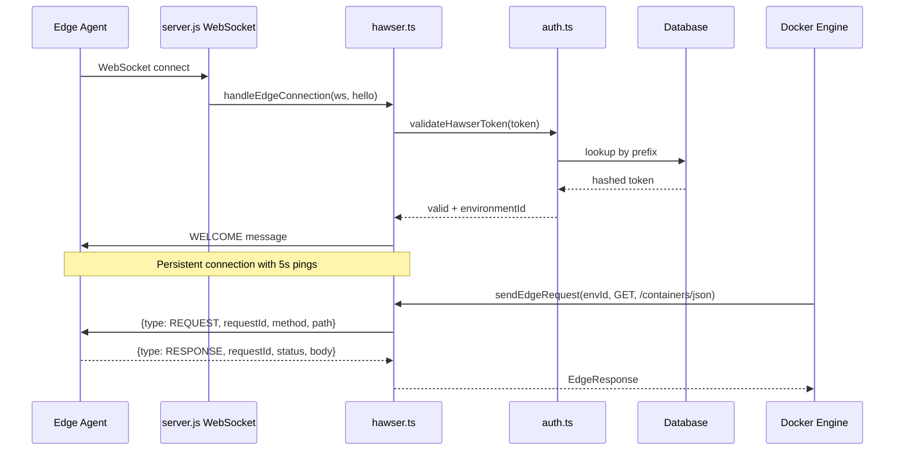

# Hawser Edge

WebSocket-based bidirectional protocol for managing Docker daemons through remote Hawser Edge agents.

## Beginner

> [!tip] Prerequisites
> Before reading this section, you should be comfortable with:
> - What WebSockets are (persistent, bidirectional connections between client and server)
> - The concept of remote management (controlling a machine you can't directly connect to)
> - Token-based authentication

### What Is This?

Hawser Edge allows Dockhand to manage Docker on remote machines that aren't directly reachable (behind firewalls, NAT, etc.). Instead of Dockhand connecting *to* the remote Docker daemon, a lightweight agent on the remote machine connects *to* Dockhand via WebSocket.

Once connected, Dockhand sends Docker API requests through the WebSocket tunnel, and the agent executes them locally against its Docker daemon. This inverts the connection direction — the agent reaches out, making firewall configuration simpler.

### Key Concepts

**Edge agent** — A small program running on the remote machine. It connects to Dockhand, authenticates with a token, and relays Docker API requests between Dockhand and the local Docker daemon.

**Token authentication** — Each agent has a unique token (hashed with Argon2id). When the agent connects, it sends a `HELLO` message with the token. Dockhand validates it and responds with `WELCOME`.

**Request/response correlation** — Each request Dockhand sends through the WebSocket gets a unique ID. When the agent sends back a response, it includes the same ID so Dockhand can match it to the original request.

### How It Works: Main Flow

1. **Agent connects** — WebSocket upgrade at `/api/hawser/connect`. Agent sends `HELLO` with token.
2. **Authentication** — Dockhand validates the token using prefix-based lookup + Argon2id verification.
3. **Connection established** — Agent is registered. Heartbeat pings start (every 5 seconds).
4. **Request relayed** — When a user operates on this environment, Docker API calls are serialized as JSON messages and sent through the WebSocket. The agent executes them and sends responses back.
5. **Disconnection** — On disconnect, pending requests are rejected and the connection is cleaned up.

> [!example] Example
> ```typescript
> // Send a Docker API request through Hawser
> const response = await sendEdgeRequest(envId, 'GET', '/containers/json');
>
> // Check if an environment has an active edge connection
> const connected = isEdgeConnected(envId);
> ```

## Intermediate

### Design Rationale

The Hawser protocol is custom rather than using an existing tunneling solution (SSH, WireGuard). This allows tight integration with Dockhand's authentication system, environment model, and real-time event streaming. The WebSocket transport works through corporate proxies and CDNs that might block other protocols.

The request/response correlation pattern (using `requestId` maps) enables concurrent requests over a single WebSocket connection, avoiding the complexity of multiple tunnels or connection multiplexing.

### Patterns Used

**Request/Response Correlation** — Two maps track pending operations:
- `pendingRequests: Map<requestId, PendingRequest>` — Standard request-response pairs
- `pendingStreamRequests: Map<requestId, PendingStreamRequest>` — Streaming responses with incremental callbacks

Each request generates a `secureRandomUUID()` as its correlation ID, set as a timeout, and cleaned up on response/error/disconnect.

**Reconnection Storm Detection** — A sliding 2-minute window tracks reconnection timestamps per environment. After 10 reconnections in the window, escalating cooldowns kick in (30s → 60s → 120s → 300s). Stable connections (5 minutes without reconnect) auto-clear the tracker.

**Dev/Production Dual Path** — In development, WebSocket messages route through `globalThis.__hawserSendMessage` (set by vite.config.ts). In production, messages go directly to `ws.send()`. This allows Vite HMR to intercept and handle WebSocket traffic during development.

### Module Interactions



### Trade-offs

- **Single connection per environment** — Only one agent can be connected per environment. New connections replace the old one (all pending requests rejected). This simplifies state management but means agent failover requires reconnection.
- **Base64 for binary data** — Binary payloads (container archives, image exports) are base64-encoded for JSON transport, adding ~33% overhead. A binary WebSocket framing mode is not implemented.
- **No agent-side authentication** — The agent trusts any Dockhand server it connects to. The token proves the agent's identity to Dockhand, but Dockhand's identity is not verified by the agent (beyond TLS if configured).

## Advanced

### Concurrency & State

**Connection state** — `edgeConnections: Map<envId, EdgeConnection>` (persisted on `globalThis` for HMR). Each connection holds: WebSocket reference, environment ID, pending request maps, ping interval, heartbeat timestamp, agent info.

**Cleanup loop** — Every 30 seconds, checks for connections idle >90 seconds (no heartbeat). Stale connections are closed and pending requests rejected.

**Auth failure cache** — `Map<remoteIp, timestamp>` with 5-minute cooldown prevents brute-force token guessing from a single IP.

**Request lifecycle** — Requests support `AbortSignal` for cancellation. On abort, the pending request is removed from the map and rejected. The agent is not notified of the cancellation (fire-and-forget from the agent's perspective).

### Performance Characteristics

- **Ping interval**: 5 seconds (conservative against proxy idle timeouts)
- **Request timeout**: Configurable per request (default varies by operation)
- **Streaming**: Base64-encoded chunks accumulated in `Buffer[]`, concatenated on `stream_end`. Memory usage proportional to total response size.
- **Token validation**: O(1) prefix lookup + O(1) Argon2id verification. Multiple tokens with the same prefix (unlikely but possible) are checked sequentially.

### Failure Modes

- **Agent disconnect during request** — All pending requests rejected with "connection lost." Callers receive a rejected promise.
- **Reconnection storm** — Rapidly reconnecting agents trigger escalating cooldowns. After 10 reconnections in 2 minutes, the next attempt is delayed 30-300 seconds.
- **Token rotation race** — `generateHawserToken()` revokes existing tokens before creating new ones. If an agent is connected during rotation, it continues on the old token until the WebSocket disconnects. The new token takes effect on next reconnect.
- **Message parsing failure** — Malformed JSON from the agent logs a warning but does not close the connection. The specific message is dropped.

> [!danger] Critical Failure Mode
> Connection replacement: when a new agent connects for the same environment, the old connection is immediately terminated and all pending requests are rejected with "Connection replaced by new agent." If this happens during a deployment, the deployment fails silently.

### Invariants & Constraints

- Protocol version is `1.0` — no version negotiation. Agent and server must agree.
- Hawser tokens are hashed with Argon2id (same as user passwords). Raw tokens are shown once at generation time and never stored.
- Token prefixes (first 8 characters) are stored in plain text for O(1) lookup. The full token is verified via Argon2id only after prefix match.
- WebSocket connections use `ws.terminate()` (immediate close) rather than `ws.close()` (graceful) for forced disconnections, to avoid waiting for the remote end.
