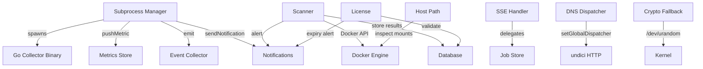

# Infrastructure Services

Thirteen independently-imported utility services providing notifications, scanning, metrics storage, subprocess management, SSE, DNS caching, encryption, licensing, and more.

## Beginner

> [!tip] Prerequisites
> Before reading this section, you should be comfortable with:
> - What utility/infrastructure code is (shared services used by other modules)
> - Basic concepts: event emitters, caching, encryption
> - The idea of background processes doing work alongside the main application

### What Is This?

This module is a collection of foundational services that other Dockhand modules depend on. Instead of each module implementing its own notifications, scanning, or metrics storage, these shared services provide the capabilities once and are imported where needed.

The services fall into three groups:

1. **Core infrastructure** — Event emitters for container events, ring-buffer metrics storage, server uptime tracking, environment icons.
2. **Docker integration** — Vulnerability scanning (Grype/Trivy), path translation for Docker mounts, DNS resolution with caching, Go subprocess management.
3. **Monitoring & communication** — Multi-channel notifications (email, Telegram, Discord), memory profiling, license validation, cryptographic fallbacks.

### Key Concepts

**Ring buffer** — A fixed-size array that overwrites the oldest entry when full. Used for metrics storage — keeps the last N data points without growing unboundedly.

**EventEmitter** — A Node.js pattern for publishing and subscribing to events. The `containerEventEmitter` is a singleton that all modules use to broadcast Docker container events.

**Subprocess manager** — Manages the Go collector binary as a child process, sending commands via stdin and reading results from stdout (JSON lines).

### How It Works: Main Flow

These services don't have a single flow — they're used independently by other modules. Here are three representative examples:

1. **Vulnerability scanning** — The scheduler triggers `scanImage()`. The scanner runs Grype or Trivy as a Docker container, parses the JSON results, stores them in the database, and sends notifications if severity thresholds are exceeded.
2. **Notification delivery** — When an auto-update completes, `sendNotification()` is called. It looks up the user's notification config (SMTP, Telegram, or Discord) and delivers the message through the appropriate channel.
3. **Metrics collection** — The subprocess manager sends Docker stats to `pushMetric()`, which stores them in a ring buffer. The frontend reads the latest metrics via `getLatestMetric()` or time-series history via `getMetricsHistory()`.

## Intermediate

### Design Rationale

Rather than bundling these services into larger modules, each is kept as a small, focused file. This reduces coupling — you can use `metrics-store.ts` (124 lines) without pulling in the scanner (1,149 lines). It also makes it easy to understand each service in isolation.

The Go subprocess pattern offloads CPU-bound Docker API polling to a compiled binary, keeping the Node.js event loop free for handling HTTP requests. The IPC protocol (JSON lines) is simple enough that either side can be replaced independently.

### Patterns Used

**Singleton via globalThis** — `event-collector.ts` uses `globalThis['__dockhand_container_event_emitter__']` to ensure a single EventEmitter instance survives Vite HMR reloads. Without this, hot-reloading would create duplicate emitters with orphaned listeners.

**Serial Locking** — `scanner.ts` uses per-scanner-type Promise queues to serialize concurrent scan requests. This prevents database lock conflicts and ensures the second scan reuses the warm database cache.

**DNS Cache with In-Flight Deduplication** — `dns-dispatcher.ts` caches DNS results (positive: 30s TTL, negative: 10s) and deduplicates concurrent lookups for the same hostname. This prevents cache stampedes when many HTTP requests fire simultaneously.

**Ring Buffer** — `metrics-store.ts` uses pre-allocated fixed-size arrays with head/count indices. O(1) append and O(1) latest-read, no garbage collection pressure from array splicing.

### Module Interactions

### Trade-offs

- **No external message queue** — Notifications are sent synchronously during the calling operation. If the SMTP server is slow, the caller blocks. An async queue would decouple notification delivery from the triggering operation.
- **Scanner as Docker container** — Grype/Trivy run inside Docker containers, which requires the Docker socket to be accessible. This means scanning doesn't work if Docker itself is down.
- **DNS cache TTL** — 30-second positive TTL means DNS changes take up to 30 seconds to propagate. This is acceptable for Docker daemon connections but could cause issues with rapidly changing DNS.

## Advanced

### Concurrency & State

**Subprocess manager** — Maintains a single Go child process. IPC messages are serialized (one JSON line at a time on stdin). Results arrive asynchronously on stdout. The manager parses each line and dispatches to the appropriate handler (metrics → ring buffer, events → EventEmitter, status → database).

**Scanner locking** — `Map<scannerType, Promise<void>>` serializes scan operations per scanner type. This prevents concurrent Docker container executions for the same scanner from conflicting.

**Metrics ring buffer** — Per-environment `{data: Array, head: number, count: number}`. Thread-safe in Node.js (single-threaded event loop) but the ring buffer is shared across all readers via module-level state.

### Performance Characteristics

- **Scanner** — Each scan spawns a Docker container, which adds ~2-5 seconds of overhead. The scanner binary itself may take 10-60 seconds depending on image size and vulnerability database freshness.
- **Notifications** — SMTP: synchronous send via nodemailer. Telegram: HTTP POST to Bot API. Discord: HTTP POST to webhook URL. Apprise: subprocess call.
- **DNS caching** — Eliminates repeated `getaddrinfo` calls for Docker daemon hostnames. In-flight deduplication prevents N concurrent requests from triggering N DNS lookups.

### Failure Modes

- **Go subprocess crash** — The subprocess manager detects the exit and can restart the collector. Metrics gap during restart window.
- **Scanner container failure** — If the Grype/Trivy container fails to start, the scan returns an error. Volume cleanup is attempted but may leave orphaned Docker volumes.
- **Notification channel unreachable** — Errors are caught and logged but don't propagate to the caller. The operation that triggered the notification succeeds regardless.
- **Kernel too old** (`crypto-fallback.ts`) — On Linux kernels < 3.17, `getrandom()` isn't available. The fallback reads directly from `/dev/urandom` to prevent Node.js crypto crashes.

> [!danger] Critical Failure Mode
> `host-path.ts` detects Docker mounts at startup by inspecting Dockhand's own container. If the detection fails or returns incorrect paths, compose volume rewriting will produce wrong host paths, potentially mounting to incorrect or nonexistent directories.

### Invariants & Constraints

- The Go collector binary must be pre-compiled and accessible at the expected path. The subprocess manager does not compile it.
- Scanner availability depends on Grype and/or Trivy Docker images being pullable. No scanner is bundled with Dockhand.
- License validation uses RSA-SHA256 with a hardcoded public key. The license key format is `base64(json({name, type, host, expiresAt, signature}))`.
- The DNS dispatcher is set globally via `undici.setGlobalDispatcher()` at module import time. This affects all HTTP requests made through undici/fetch.
