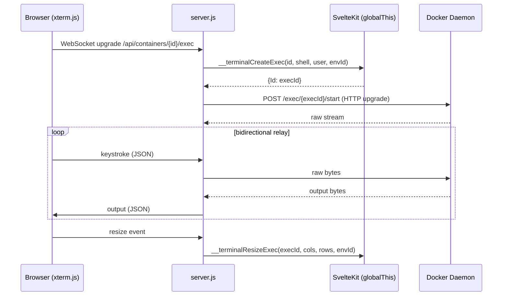

# Production Server

The Node.js HTTP server wrapping SvelteKit with WebSocket upgrade support for terminal sessions and Hawser agent connections.

## Beginner

> [!tip] Prerequisites
> Before reading this section, you should be comfortable with:
> - What an HTTP server does (listens for requests, sends responses)
> - The difference between HTTP requests and WebSocket connections
> - What a terminal emulator does (provides a command-line interface)

### What Is This?

When Dockhand runs in production, this file (`server.js`, 457 lines) is the entry point. It creates an HTTP server that handles two kinds of traffic:

1. **Regular HTTP requests** — Passed to SvelteKit for page rendering and API handling.
2. **WebSocket connections** — Handled directly for two features:
   - **Terminal sessions** — When you open a terminal to a container in the browser, keystrokes travel over a WebSocket to this server, which relays them to a Docker exec session.
   - **Hawser agents** — Remote Docker agents connect via WebSocket for bidirectional communication.

### Key Concepts

**WebSocket upgrade** — An HTTP request can be "upgraded" to a WebSocket connection. The server checks the URL path to decide what kind of WebSocket session to create.

**Docker exec** — Docker's API allows running commands inside a running container. The server creates an exec session and streams its input/output over the WebSocket to the browser's terminal emulator (xterm.js).

**globalThis bridge** — SvelteKit and server.js are separate modules that can't easily import each other. Instead, SvelteKit registers functions on `globalThis` (the global object), and server.js calls them. This is how the server gets Docker connection info and Hawser message handlers.

### How It Works: Main Flow

1. **HTTP request arrives** — If it's a regular request, SvelteKit handles it.
2. **WebSocket upgrade detected** — Server checks the URL path:
   - `/api/containers/.../exec` → Terminal session
   - `/api/hawser/connect` → Hawser agent connection
3. **Terminal: Docker exec relay** — Server creates a Docker exec instance, streams input from the browser to Docker and output from Docker to the browser.
4. **Hawser: Agent protocol** — Server delegates to `__hawserHandleMessage` for authentication and message routing.

## Intermediate

### Design Rationale

SvelteKit's adapter-node doesn't support WebSocket connections natively. Rather than patching the adapter or using a separate WebSocket server on a different port, `server.js` wraps the SvelteKit handler in a plain `http.createServer()` and intercepts WebSocket upgrade requests before they reach SvelteKit.

The `globalThis` bridge pattern is a pragmatic solution to the circular dependency problem: server.js starts before SvelteKit loads, but needs SvelteKit's Docker and Hawser modules for WebSocket handling. By having SvelteKit register functions on `globalThis` during initialization, server.js can call them without importing SvelteKit's internals.

### Patterns Used

**URL-based WebSocket Routing** — WebSocket upgrade requests are dispatched by URL path. Unknown paths result in socket destruction (security measure). This is simpler than a full WebSocket routing framework.

**Stream Relay** — Terminal sessions create a bidirectional relay: browser WebSocket ↔ server.js ↔ Docker HTTP stream. The server handles Docker's chunked transfer encoding, strips HTTP headers from the initial response, and demultiplexes the Docker stream protocol.

**Fallback for Startup Race** — If SvelteKit's `__terminalGetTarget` function isn't registered yet (server started before SvelteKit), server.js falls back to the local Docker socket. This prevents crashes during the brief startup window.

### Module Interactions

### Trade-offs

- **Single process** — WebSocket handling shares the event loop with SvelteKit. A flood of terminal traffic could theoretically slow API responses, though in practice the relay is lightweight.
- **No backpressure** — The terminal relay doesn't implement flow control. If a client sends data faster than Docker processes it, the server buffers it in memory.
- **Console timestamp patching** — The module patches `console.log/error/warn` at load time to prepend ISO timestamps. This is a side effect that affects all subsequent logging.

## Advanced

### Concurrency & State

- **`wsConnections: Map`** — Tracks active terminal WebSocket connections and their associated Docker streams for cleanup on disconnect.
- **`edgeExecSessions: Map<execUUID, {ws, environmentId}>`** — Tracks exec sessions initiated through Hawser Edge agents (terminal-over-WebSocket-over-WebSocket).
- **globalThis state** — Functions and connection maps registered by SvelteKit modules, shared across the process.

### Performance Characteristics

- Chunked transfer encoding parsing uses regex to strip chunk size prefixes. Each Docker stream frame is processed and forwarded immediately (no buffering across frames).
- HTTP header stripping from Docker exec responses is done once per connection (initial response only).

### Failure Modes

- **SvelteKit not loaded** — If `__terminalGetTarget` is not registered, falls back to local Docker socket. If `__hawserHandleMessage` is not registered, Hawser connections fail silently.
- **Docker stream close** — When Docker closes the exec stream (container stops, exec exits), the server detects the close event and terminates the browser WebSocket.
- **Malformed JSON from browser** — Terminal and Hawser message parsing is wrapped in try-catch. Malformed messages are logged and dropped.

### Invariants & Constraints

- `server.js` is plain JavaScript (not TypeScript) because it runs directly via `node ./server.js` without a build step for itself. The SvelteKit build output (`./build/handler.js`) is imported at runtime.
- The server listens on `PORT` (default 3000) and `HOST` (default 0.0.0.0).
- WebSocket connections to unknown paths are immediately destroyed (socket.destroy()) as a security measure.
