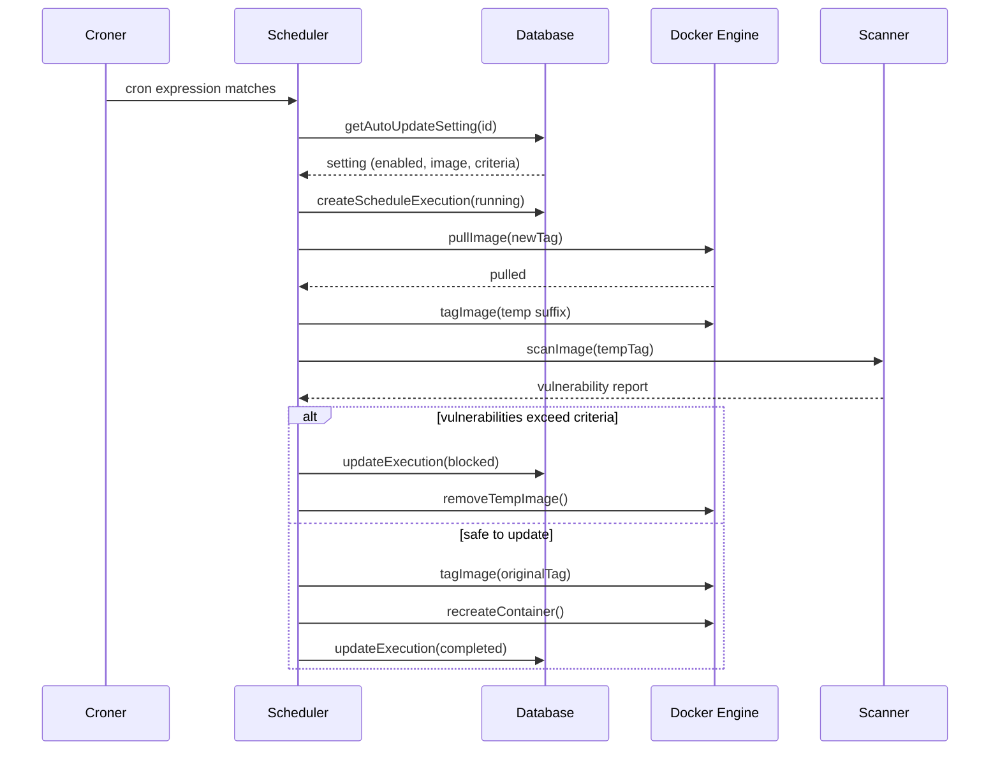

# Scheduler

Cron-based task scheduling for container auto-updates, git stack syncing, environment update checks, image pruning, and system cleanup.

## Beginner

> [!tip] Prerequisites
> Before reading this section, you should be comfortable with:
> - What cron expressions are (e.g., `0 3 * * *` means "3 AM daily")
> - The concept of scheduled/automated tasks
> - Why automated updates need safety checks

### What Is This?

This module runs tasks automatically on a schedule. Think of it as Dockhand's built-in task scheduler — it handles things that should happen regularly without human intervention:

- **Container auto-updates** — Periodically checks if a container's image has a newer version, pulls it, optionally scans for vulnerabilities, and recreates the container with the new image.
- **Git stack syncing** — Pulls the latest changes from Git repositories and redeploys stacks if the compose file changed.
- **Environment update checks** — Scans all containers in an environment to find which ones have pending updates.
- **Image pruning** — Removes unused Docker images to free disk space.
- **System cleanup** — Purges old execution logs, container events, and stale volume helpers.

### Key Concepts

**Cron job** — A task that runs on a schedule defined by a cron expression. The `croner` library handles the timing.

**Execution record** — Every time a scheduled task runs, a record is created in the database with the start time, status (running/completed/failed), log output, and duration. This provides an audit trail.

**Vulnerability scanning** — Before auto-updating a container, the scheduler can scan the new image for security vulnerabilities. If the scan finds issues that exceed your configured criteria, the update is blocked.

### How It Works: Main Flow

1. **Startup** — `startScheduler()` loads all schedules from the database and registers cron jobs.
2. **Cron fires** — When a schedule's cron expression matches the current time, the task function runs.
3. **Execution tracked** — A database record is created with status `running`. Logs are appended in real-time.
4. **Task completes** — The record is updated with final status, details, and duration.

> [!example] Example
> ```typescript
> // Start the scheduler on server boot
> await startScheduler();
>
> // Manually trigger a container update check
> await triggerContainerUpdate(settingId);
>
> // Register a new schedule from the UI
> await registerSchedule(id, 'container_update', envId);
> ```

## Intermediate

### Design Rationale

The scheduler is split into an orchestrator (`index.ts`, 711 lines) and per-task executors (`tasks/`). The orchestrator manages job lifecycle, cron registration, and manual triggers. Each task executor contains the domain-specific logic for one task type. This keeps the scheduling infrastructure separate from the update/sync/prune logic.

Tasks run in-process (not as separate workers) because they need direct access to the Docker module, database, and scanner. The trade-off is that a long-running task blocks its cron slot — the scheduler uses `legacyMode: false` in croner (AND logic for day-of-month + day-of-week) and defensive re-fetch of schedule config at execution time.

### Patterns Used

**Safe Container Update Flow** — The auto-update task implements a multi-step safety pipeline:
1. Pull new image
2. Restore original tag to OLD image (safety: can roll back by name)
3. Tag new image with temp suffix (`-dockhand-pending`)
4. Scan temp image for vulnerabilities
5. Block update if vulnerabilities exceed criteria
6. Re-tag approved image to original
7. Recreate container with full config passthrough

**Execution Tracking** — Every task creates a `ScheduleExecution` record at start. Logs are appended incrementally via `appendScheduleExecutionLog()`. Final status, details, and duration are recorded on completion. This provides real-time visibility in the UI.

**Concurrent Execution Prevention** — Environment update checks use a `Set<number>` to track running checks per environment. A second check for the same environment is rejected while one is in progress.

### Module Interactions



### Trade-offs

- **In-process execution** — Tasks share the Node.js event loop. A CPU-intensive scan could block other operations. The Go collector handles the most CPU-intensive work (metrics), mitigating this.
- **No distributed locking** — The scheduler assumes a single server instance. Running multiple Dockhand instances against the same database would cause duplicate task execution.
- **Timezone per environment** — Each environment can have a custom timezone. Changing the timezone requires re-registering all cron jobs for that environment.

## Advanced

### Concurrency & State

- **`activeJobs: Map<compositeKey, Cron>`** — Tracks all registered cron jobs. Composite key is `${type}:${id}`.
- **`runningEnvChecks: Set<number>`** — Prevents concurrent environment-wide update checks.
- **Process-level** — Task functions are async but not parallelized within a single task. The container update task processes one container at a time within a single schedule execution.

### Performance Characteristics

- **Container update** — Dominated by image pull time and optional vulnerability scan. Pull time depends on image size and registry speed. Scan time depends on scanner (Grype/Trivy) and image layer count.
- **Environment check** — Scans all containers sequentially. For environments with 50+ containers, this can take several minutes.
- **System cleanup** — Database DELETE operations with retention-based WHERE clauses. Performance depends on the number of records to delete.

### Failure Modes

- **Task exception** — Uncaught exceptions in task functions are caught by the orchestrator, logged to the execution record, and the task is marked as failed. The cron job continues for future executions.
- **Mid-update crash** — If the server crashes during a container update (after pull, before recreate), the temp-tagged image remains. It's cleaned up on the next scan or manually.
- **Stale sync state** — Git stacks stuck in `syncing` state (from a crash) are reset to `pending` by `cleanupStaleSyncStates()` at scheduler startup.
- **Database contention** — Execution log appending during a long task generates many small writes. In SQLite with WAL mode, this is generally fine; under heavy concurrent load, busy timeout (5s) may be hit.

### Invariants & Constraints

- Croner uses `legacyMode: false` — day-of-month and day-of-week use AND logic (both must match), not OR logic.
- Task functions re-fetch the schedule config from the database at execution time. If the schedule was disabled or deleted between cron fire and execution, the task exits early.
- The `croner` library handles cron parsing and scheduling. No custom cron parser exists in the codebase.
- System cleanup jobs (event cleanup, execution cleanup, volume helper cleanup) are registered from database-seeded records with default cron expressions.
