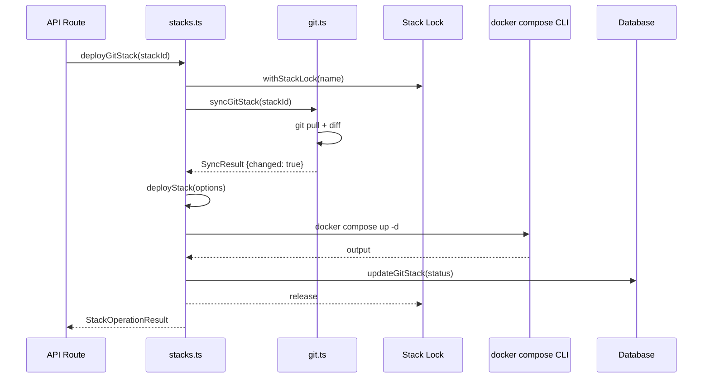

# Stacks and Git

Docker Compose stack lifecycle management with three source types (internal, git, external) and Git repository integration for automated deployments.

## Beginner

> [!tip] Prerequisites
> Before reading this section, you should be comfortable with:
> - What Docker Compose is (multi-container application definitions in YAML)
> - Basic Git concepts (clone, pull, branches, commits)
> - The difference between local files and remote repositories

### What Is This?

This module manages Docker Compose "stacks" — multi-container applications defined in `docker-compose.yml` files. It handles three sources of stacks:

1. **Internal stacks** — Created directly in Dockhand's UI. The compose files are stored on the server.
2. **Git stacks** — Pulled from Git repositories. Dockhand clones the repo, detects changes, and redeploys when the compose file changes.
3. **External/adopted stacks** — Existing compose files discovered on the filesystem and registered with Dockhand.

The Git integration handles cloning repositories (with SSH key or HTTPS credentials), tracking which commit is deployed, detecting changes via `git diff`, and triggering automated redeployments.

### Key Concepts

**Stack** — A Docker Compose application. One `docker-compose.yml` file defines multiple containers (services), volumes, and networks that work together.

**Deployment** — Running `docker compose up` to create and start the containers defined in a stack. Dockhand wraps this with environment variable injection, TLS configuration for remote daemons, and progress tracking.

**Git sync** — Pulling the latest changes from a repository and checking if the compose file changed. If it did, the stack is redeployed automatically (if auto-sync is enabled).

### How It Works: Main Flow

1. **Create stack** — User creates a stack (writes compose file in UI, or connects a Git repository).
2. **Deploy** — Dockhand runs `docker compose up -d` with the right environment variables and Docker connection settings.
3. **Monitor** — The stack's containers appear in the dashboard, managed like any other containers.
4. **Update (Git)** — On schedule or manual trigger, Dockhand pulls the repo, diffs the compose file against the deployed version, and redeploys if changed.

> [!example] Example
> ```typescript
> // Deploy an internal stack
> await deployStack({ name: 'my-app', environmentId: 1 });
>
> // Sync a git stack and deploy if changed
> await deployGitStack(stackId, { force: false });
> ```

## Intermediate

### Design Rationale

The module separates stack orchestration (`stacks.ts`) from Git operations (`git.ts`) and filesystem discovery (`stack-scanner.ts`). This keeps the 2,547-line deployment logic independent of Git-specific concerns like SSH key management and credential encryption.

Deployment is implemented by spawning `docker compose` as a child process rather than calling Docker API endpoints directly. This is pragmatic — Docker Compose handles service dependency ordering, network creation, and volume mounting that would be extremely complex to reimplement.

### Patterns Used

**Per-Stack Locking** — A `Map<string, Promise<void>>` ensures only one operation runs per stack at a time. All state-modifying operations (deploy, stop, remove) acquire the lock via `withStackLock()`. This prevents races like two simultaneous deployments overwriting each other.

**Connection Routing** — Deployment routes through three execution paths:
- `executeLocalCompose()` — Direct `docker compose` invocation for local/direct connections
- `executeComposeViaHawser()` — HTTP relay through Hawser agent
- `executeComposeCommand()` — Router that selects the correct path

**Change Detection** — Git stacks use `git diff --name-only` scoped to the compose file's directory to detect whether a redeployment is needed. This avoids unnecessary restarts when unrelated files in the repository change.

### Module Interactions



### Trade-offs

- **Child process spawning** — Each deployment spawns a `docker compose` process. This has ~200ms overhead and requires the `docker compose` binary to be available in PATH. However, it avoids reimplementing Compose's complex orchestration logic.
- **SSH key temp files** — SSH keys are written to `/tmp/` (not the data volume) due to chmod issues on NFS/ZFS filesystems. This means keys exist briefly as files on disk.
- **Dynamic imports** — `stacks.ts` uses `await import('./docker.js')` to avoid circular dependencies with the Docker module. This breaks static analysis tooling.

## Advanced

### Concurrency & State

- **Stack locks** — `Map<string, Promise<void>>` chains operations per stack. No cross-stack locking — multiple stacks can deploy simultaneously.
- **Active TLS dirs** — `Set<string>` tracks temporary TLS certificate directories for cleanup on process exit (SIGTERM/SIGINT handlers).
- **Process timeout** — Compose operations have a 15-minute default timeout (`COMPOSE_TIMEOUT` env var). After timeout, SIGTERM is sent with a 5-second grace period before SIGKILL.

### Performance Characteristics

- **Blobless clone** — Git repositories are cloned with `--filter=blob:none` to minimize disk usage and clone time. Only the tree structure is fetched upfront; blobs are fetched on demand.
- **Diff-scoped deployments** — Only changes within the compose file's directory trigger redeployment, avoiding unnecessary container restarts.
- **Environment variable injection** — For local deployments, variables are split between shell environment and `.env` file. For Hawser deployments, all variables are injected via shell (no `.env` file support on remote).

### Failure Modes

- **Compose process crash** — If `docker compose` exits non-zero, the error output is captured and returned. The stack is left in whatever state Docker Compose reached before failure.
- **Git SSH failure** — SSH key permission issues, passphrase decryption failures, or host key verification problems are caught and returned as sanitized error messages (SSH noise stripped via `cleanGitError()`).
- **Stale sync state** — If the server crashes during a git sync, the stack may be stuck in 'syncing' state. `cleanupStaleSyncStates()` resets these on startup.
- **Force push handling** — If a force push changes the commit history, `git diff` may fail. The module treats this as "changed" and redeploys.

> [!danger] Critical Failure Mode
> Volume path translation (`rewriteComposeVolumePaths`) rewrites relative paths in compose files to absolute host paths. If the path detection fails or the host data directory is wrong, volumes will mount to incorrect locations, potentially exposing or overwriting host files.

### Invariants & Constraints

- Stack names are normalized (lowercase, alphanumeric + hyphens) to ensure filesystem and Docker compatibility.
- Git credentials (passwords, SSH keys) are encrypted in the database and decrypted only when needed for a git operation.
- The `docker compose` binary must be available in PATH. Dockhand does not bundle it.
- Webhook-triggered syncs bypass the scheduler but still acquire the per-stack lock.
