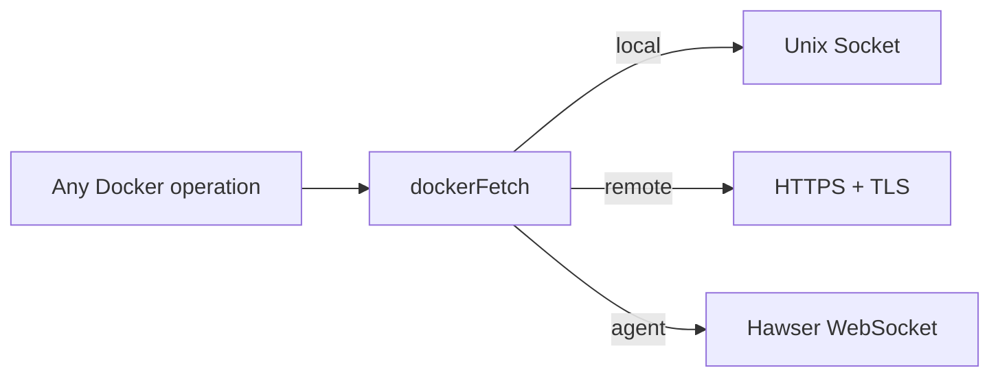

# Transport Adapter

A routing pattern that dispatches Docker API requests to different transport backends (Unix socket, HTTPS, WebSocket relay) based on environment configuration, keeping all consumer code transport-agnostic.

## Beginner

> [!tip] Prerequisites
> Before reading this section, you should be comfortable with:
> - What an adapter pattern is (translating one interface to another)
> - Different network transport types (sockets, HTTP, WebSocket)

### What Is This?

Dockhand needs to talk to Docker daemons in three different ways depending on where Docker is running. The Transport Adapter pattern hides this complexity behind a single function — `dockerFetch()` — so the rest of the codebase doesn't need to know *how* to reach Docker, only *what* to ask it.

### How It Works

1. Caller provides an API path, method, and environment ID.
2. `dockerFetch` looks up the environment's connection type from a cached config.
3. The request is dispatched to the matching transport function.
4. The response is normalized to a standard `Response` object regardless of transport.

## Intermediate

### Where It Appears

- **`dockerFetch()`** in `src/lib/server/docker.ts` — The central dispatch function (200+ lines).
- **`executeComposeCommand()`** in `src/lib/server/stacks.ts` — Routes compose operations to local CLI, direct TCP, or Hawser relay.
- **Go Collector** — Implements the same multi-transport pattern in Go (`socket` vs `http` vs `https` connection types).

### Why This Pattern

The alternative — having each of the 100+ Docker API functions handle transport selection — would create massive duplication and make adding a new transport type require changes across the entire codebase. With the adapter, adding a new transport (e.g., SSH tunneling) would require changes only in `dockerFetch()`.

### Implementation Details

- **Config caching**: Environment configs are cached in a `Map<envId, {env, lastUsed}>` with 30-minute TTL to avoid repeated database queries.
- **Error normalization**: Each transport produces different error types. `DockerConnectionError.fromError()` translates them all into user-friendly messages.
- **Streaming support**: The transport adapter handles both buffered responses (JSON API calls) and streaming responses (logs, events, exec output).

## Advanced

### Edge Cases

- **Hawser binary data**: WebSocket transport base64-encodes binary payloads (archives, image exports), adding ~33% overhead. Socket and HTTPS transport binary natively.
- **Path traversal**: `dockerFetch` validates that API paths don't contain `..` segments before dispatching, regardless of transport.
- **Connection replacement**: If a Hawser agent reconnects mid-request, the pending request is rejected. The caller must handle this error and potentially retry.
- **TLS certificate rotation**: HTTPS agent instances are cached by certificate hash. When certificates change, a new agent is created automatically.
