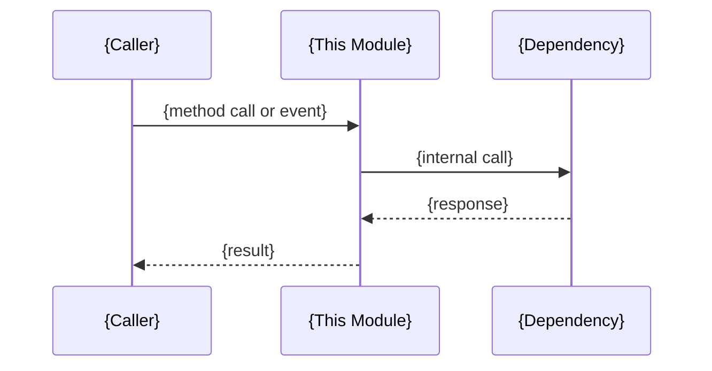
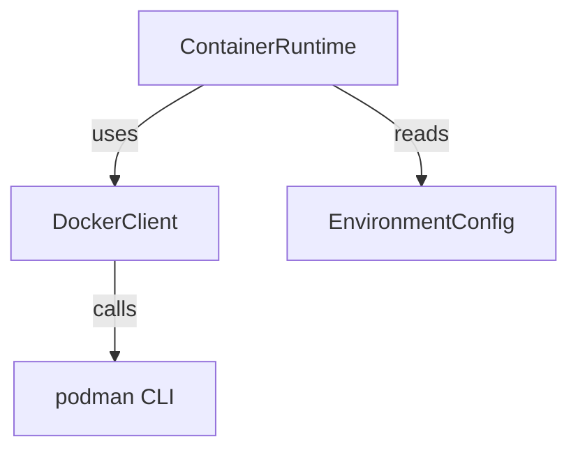
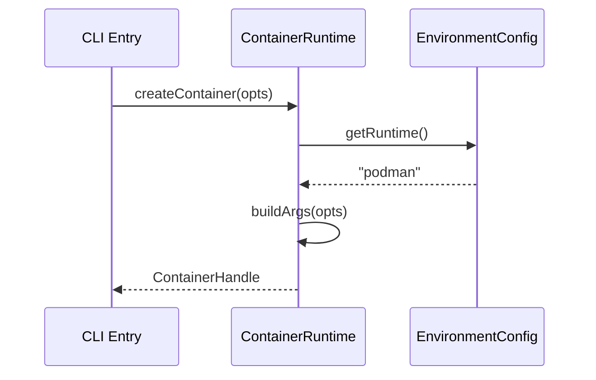
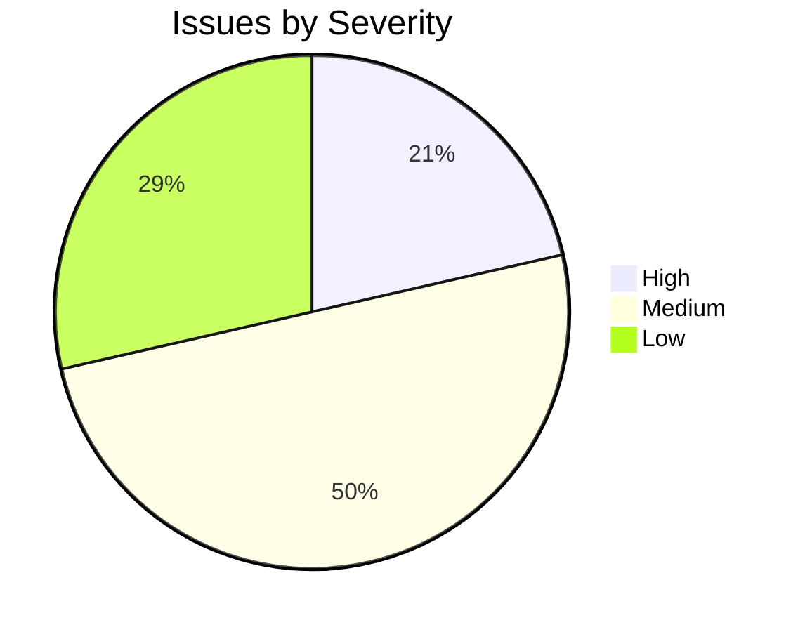
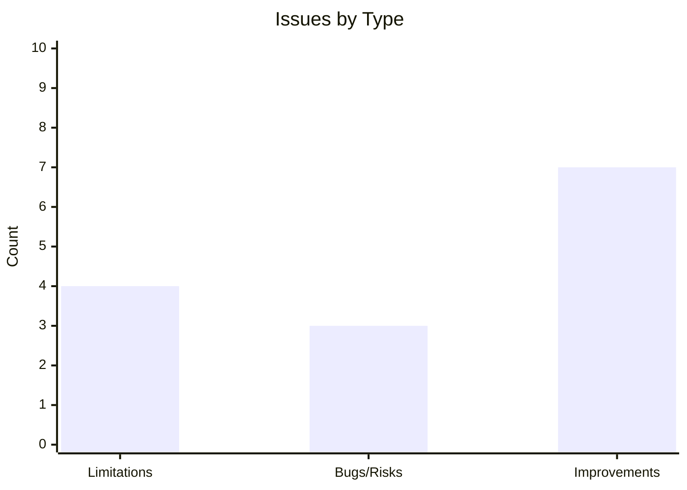

# Obsidian Templates — Formatting Reference

This reference defines the exact output format for all files generated by the `code-to-docs` skill. Every generated file must conform to the frontmatter schema and audience-level structure defined here. The Dataview queries in `[[output-structure]]` depend on these fields.

---

## 1. Frontmatter Schema

Every generated file MUST include this frontmatter block as the very first thing in the file, before any other content.

```yaml
---
title: string
type: module | architecture | pattern | onboarding | cross-cutting | health | index
language:
  - string
status: generated
complexity: low | medium | high
dependencies:
  - "[[Module Name]]"
related-notes:
  - "[[Module Name]]"
canonical-source: string       # file path in the analyzed codebase
generated-by: code-to-docs
generated-at: ISO 8601
mode: quick | full
tags:
  - code-docs
  - {type}                     # module, pattern, onboarding, etc.
---
```

### Field Rules

**`title`**
Plain string. Use the module or concept name as it appears in the codebase — do not invent a display name.

**`type`**
One of: `module`, `architecture`, `pattern`, `onboarding`, `cross-cutting`, `health`, `index`. Must match the `{type}` tag entry.

**`language`**
Always a YAML list, even for a single language. Write `["typescript"]`, never `"typescript"`. Multiple languages are common for projects with both runtime and config layers.

**`status`**
Always `generated`. This field allows Dataview queries to exclude hand-written notes.

**`complexity`**
Assessed by the generating agent based on the source file(s):
- `low` — single-purpose, under 200 LOC
- `medium` — multiple concerns, 200–1000 LOC
- `high` — complex interactions, over 1000 LOC, or involves concurrency, global state, or significant side effects

**`dependencies`**
Wikilink-formatted list of module names this document's subject directly depends on. Only include direct dependencies — not transitive ones. Every listed wikilink must correspond to an existing generated file.

**`related-notes`**
Wikilinks to related docs that are conceptually linked but are not direct dependencies. Examples: a pattern that this module exemplifies, an onboarding doc that references this module, an architecture overview.

**`canonical-source`**
Relative path from the codebase root to the primary source file. For multi-file modules, use the entry point or index file. Example: `src/container-runtime.ts`.

**`generated-by`**
Always `code-to-docs`. Fixed string for filtering.

**`generated-at`**
ISO 8601 datetime, zero-padded. Required for correct Dataview sort order. Example: `2026-03-28T14:05:00Z`. Do not omit the time component.

**`mode`**
Either `quick` (single-pass, function signatures and summary only) or `full` (all three audience levels, diagrams, cross-references).

**`tags`**
Always include `code-docs` as the first tag. The second tag must match the `type` field exactly (e.g., `module`, `pattern`).

---

## 2. Audience Levels

All module docs contain three audience-level sections regardless of mode. Each is a top-level heading (`##`).

The three levels are not summaries of each other — they are distinct entry points for readers with different backgrounds. Do not repeat information verbatim across levels.

---

### Beginner

| Attribute | Value |
|-----------|-------|
| **Assumes** | Reader is new to the language or ecosystem. May be comfortable with general programming but unfamiliar with TypeScript, Go, Python idioms, or the project's domain. |
| **Focus** | What this module is and why it exists. Avoid implementation details that require prior knowledge to interpret. |
| **Tone** | Patient, welcoming, no assumed context. Define every term on first use. |

**Minimum content:**
- A prerequisites callout listing what the reader should know before reading
- A plain-language explanation of what the module does (no jargon)
- Key concepts section explaining the language constructs or domain terms used
- An annotated walkthrough of the main flow — step-by-step, not line-by-line

**Template:**

```markdown
## Beginner

> [!tip] Prerequisites
> Before reading this section, you should be comfortable with:
> - {prerequisite 1}
> - {prerequisite 2}

### What Is This?

{Plain-language explanation of what the module does and why it exists. No jargon. If jargon is unavoidable, define it inline.}

### Key Concepts

**{Concept or language construct}**
{Definition. Explain the construct itself before explaining how this module uses it.}

**{Concept or language construct}**
{Definition.}

### How It Works: Main Flow

{Brief scene-setting sentence.}

1. **{Step name}** — {What happens and why. One or two sentences.}
2. **{Step name}** — {What happens and why.}
3. **{Step name}** — {What happens and why.}

> [!example] Example
> {Minimal, runnable or copy-pasteable usage example. Annotate non-obvious lines with inline comments.}
```

---

### Intermediate

| Attribute | Value |
|-----------|-------|
| **Assumes** | Competent in the primary language. Familiar with common patterns (dependency injection, event emitters, middleware, etc.). Interested in design decisions, not just mechanics. |
| **Focus** | Why this module is structured the way it is. Trade-offs made. How it fits into the larger system. |
| **Tone** | Peer-to-peer. Assume the reader can read code — explain decisions, not syntax. |

**Minimum content:**
- Design rationale: why this structure was chosen over alternatives
- At least one identified pattern (named, with a brief explanation of how it applies here)
- Module interaction description — if the interaction involves 3 or more steps, use a Mermaid diagram

**Template:**

```markdown
## Intermediate

### Design Rationale

{Explain the key design decisions. What problem does this structure solve? What alternatives were considered or ruled out? Keep this honest — if there are known trade-offs, name them.}

### Patterns Used

**{Pattern name}** — {One sentence on what the pattern is.} This module uses it to {explain the specific application}.

{Add further patterns if present. Only name patterns that genuinely apply — do not force-fit.}

### Module Interactions

{Describe how this module interacts with its dependencies and consumers. If the interaction is simple (1–2 steps), prose is fine. For 3 or more steps, use a Mermaid diagram.}



### Trade-offs

{What alternatives exist? Why was this approach chosen? Only state what's inferable from the code, comments, or commit history. If the rationale is not documented, say "Rationale not documented."}
```

---

### Advanced

| Attribute | Value |
|-----------|-------|
| **Assumes** | Deep experience with the language and ecosystem. Familiar with concurrency models, performance profiling, failure analysis, and system design at scale. |
| **Focus** | Failure modes, concurrency behaviour, performance characteristics, subtle invariants, and non-obvious constraints. |
| **Tone** | Dense, precise. Use exact terminology. Omit basics entirely. |

**Minimum content:**
- At least one of: concurrency model, performance characteristics, or failure modes
- If none of these genuinely apply (e.g., a pure utility module with no concurrency, no performance sensitivity, and no meaningful failure surface), explicitly state this and explain why — do not fabricate depth

**Template:**

```markdown
## Advanced

### Concurrency & State

{Describe the concurrency model if applicable: thread safety guarantees, async patterns, race conditions to be aware of, lock boundaries, event loop assumptions. If the module is purely synchronous and single-threaded with no shared state, state this explicitly.}

### Performance Characteristics

{Describe complexity, hot paths, known bottlenecks, memory allocation patterns, caching behaviour, or I/O amplification risks. If none apply meaningfully, say so.}

### Failure Modes

{Enumerate the ways this module can fail: error types thrown, what triggers them, and what the caller must handle. Distinguish between expected errors (recoverable) and unexpected errors (bugs or infrastructure failures).}

> [!danger] Critical Failure Mode
> {If there is a failure mode that silently corrupts state, causes data loss, or has security implications, call it out here.}

### Invariants & Constraints

{List non-obvious invariants the module maintains or depends on. Examples: "the config object is frozen after first read", "this must be called before X is initialised", "assumes exclusive write access to the database file".}
```

---

## 3. Wikilink Conventions

All cross-references between generated files use Obsidian wikilink syntax.

| Use Case | Syntax | Notes |
|----------|--------|-------|
| Link to another module doc | `[[Module Name]]` | Matches the `title` frontmatter field of the target file |
| Link to a specific audience section | `[[Module Name#Beginner]]` | Use when directing a reader to a specific level |
| Link with custom display text | `[[Module Name\|display text]]` | Use only when the raw module name would be unclear in context |

**Rules:**
- Every wikilink MUST have a corresponding generated file. Do not create speculative links to files that have not been generated yet.
- When referencing a module in prose for the first time in a section, use a wikilink. Subsequent mentions in the same section may use plain text.
- The `dependencies` and `related-notes` frontmatter fields must also use wikilink syntax: `"[[Module Name]]"`.

---

## 4. Callout Usage

Obsidian callouts provide structured emphasis. Use them consistently — overuse degrades signal.

| Callout | Use For |
|---------|---------|
| `> [!tip]` | Prerequisites, helpful context that improves comprehension but is not mandatory |
| `> [!warning]` | Breaking changes, gotchas, known issues, deprecated patterns |
| `> [!example]` | Code examples, usage demonstrations, concrete illustrations |
| `> [!note]` | Supplementary information, version notes, tangential context |
| `> [!danger]` | Security concerns, critical failure modes, data-loss risks |

**Foldable callouts:** Append `-` to make a callout collapsed by default. Use this for long examples that are useful on demand but would interrupt the reading flow if always expanded.

```markdown
> [!example]- Full configuration example
> {Long code block that readers may want to expand selectively}
```

**Rules:**
- One callout type per purpose — do not use `[!tip]` for warnings.
- Do not use callouts as generic block quotes. Every callout must serve one of the purposes in the table above.
- Nest callouts only when the inner callout genuinely belongs inside the outer context (rare).

---

## 5. Mermaid Diagram Conventions

Use diagrams to communicate structure and flow that prose handles poorly. Do not add diagrams for their own sake.

| Diagram Type | Use For |
|--------------|---------|
| `graph TD` | Dependency trees, module hierarchies, top-down structural relationships |
| `sequenceDiagram` | Multi-step interactions between components over time |
| `flowchart LR` | Data flow, left-to-right pipelines, transformation chains |
| `classDiagram` | Type relationships, interfaces, inheritance, composition |

**Rules:**
- Keep diagrams under 20 nodes. If a diagram grows beyond 20 nodes, split it into multiple focused diagrams rather than producing one unreadable one.
- Label all edges. An unlabelled arrow conveys nothing beyond "these things are connected."
- Use consistent aliases within a diagram. If a component is `ContainerRuntime` in the diagram, do not call it `Runtime` in the labels.
- Prefer `sequenceDiagram` for the Intermediate audience level when describing module interactions with 3 or more steps.
- Diagrams are placed inside fenced code blocks with the `mermaid` language tag. No other content goes inside the block.

**Example — dependency graph:**



**Example — sequence diagram:**



---

## 6. Health Report Templates

The `Health/` directory contains three files that assess codebase quality. These are generated in both quick and full modes.

### Health Summary.md

The hub page for codebase health. Contains:

1. **Severity breakdown** — Mermaid pie chart showing issue distribution by severity



2. **Issues by type** — Mermaid bar chart



3. **Issues by module** — Mermaid bar chart showing which modules carry the most issues
4. **Summary table** — Dataview query pulling from `#health` tagged files

### Limitations.md

Documents architecture and design constraints. Each limitation is a section:

```markdown
### {Limitation Title}

**Module:** [[{Module Name}]]
**Severity:** {high|medium|low}
**File:** `{relative/path}:{line range}`

{Description of the constraint — what it prevents, why it exists, what would need to change to remove it.}

> [!warning] Impact
> {Concrete consequences of this limitation for users or developers.}

> [!tip] Possible Approach
> {If a mitigation or resolution path is inferable, describe it. If not, state "No clear resolution path from current code."}
```

### Code Review.md

Documents bugs, risks, and improvement opportunities. Each item is a section:

```markdown
### {Issue Title}

**Module:** [[{Module Name}]]
**Type:** {bug-risk|improvement}
**Severity:** {high|medium|low}
**File:** `{relative/path}:{line range}`

{Description of the issue.}

> [!danger] Why This Matters
> {For bugs/risks: what can go wrong, under what conditions.}

> [!example] Current Code
> ```{language}
> {The problematic code snippet — keep short, just enough to show the issue.}
> ```

> [!tip] Suggested Improvement
> ```{language}
> {How the code could be improved. Include the fix or refactored version.}
> ```
> {Brief explanation of why this is better.}
```

The before/after code comparison is the core educational value — readers learn by seeing what's wrong and what better looks like. Only include a suggested improvement when the fix is clear and defensible. For ambiguous cases, describe the trade-offs instead.

## 7. Educational Review Callouts in Module Docs

Within the **Advanced** section of each module doc, add a `### Code Review Notes` subsection when the agent identified issues for that module. This keeps educational content close to the code it references.

```markdown
### Code Review Notes

> [!warning] {Issue title}
> **File:** `{path}:{lines}` | **Severity:** {level}
>
> {Description of the issue and why it matters.}
>
> **Current approach:**
> ```{language}
> {problematic snippet}
> ```
>
> **Better approach:**
> ```{language}
> {improved snippet}
> ```
> {Why this is better — the educational explanation.}
```

Rules:
- Only include review notes when agents identified real issues. Do not fabricate issues to fill this section.
- Link each note to the corresponding entry in `[[Code Review]]` or `[[Limitations]]` for full context.
- Keep snippets minimal — just enough to show the issue and fix, not the entire function.
- The tone is educational, not judgmental. Frame issues as learning opportunities.

---

## 8. Dataview Queries & Obsidian Bases

Two index mechanisms are generated — users can use either or both:

**`Documentation.base`** (native, no plugins) — an Obsidian Bases catalog with interactive table/card views, filterable by type, complexity, language. See `output-structure.md` for the `.base` JSON schema.

**`Index.md`** (Dataview plugin) — Dataview query templates defined in `output-structure.md` (Index.md Template section). The queries depend on the frontmatter fields and tags defined in Section 1 above — specifically `title`, `language`, `complexity`, `status`, `type`, and `generated-at`, plus the `#code-docs` and `#{type}` tags.

Both depend on the same frontmatter schema. The `.base` file uses Obsidian's native property system; Dataview queries parse the YAML frontmatter directly. Consistency in frontmatter is critical for both to work.
